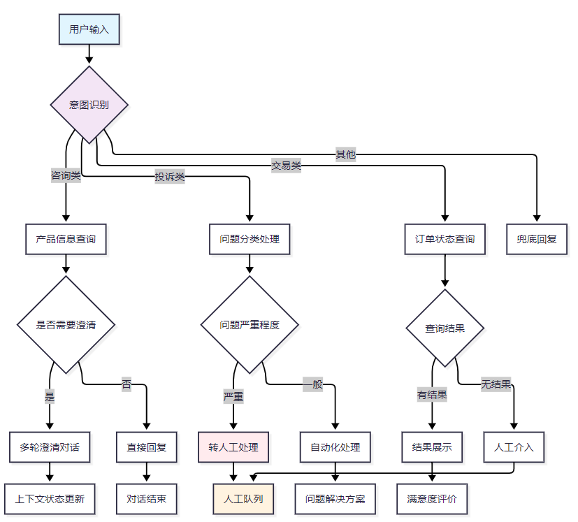
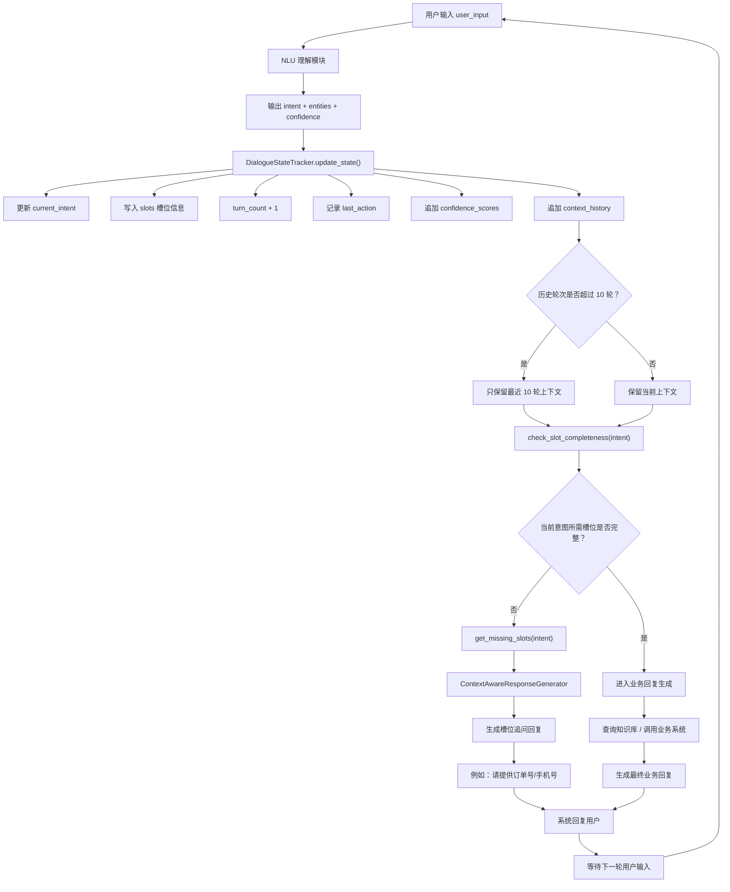
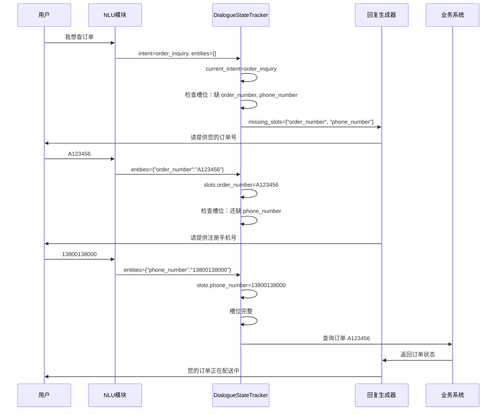
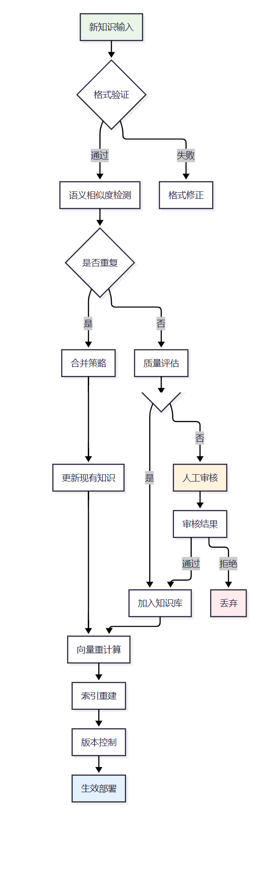
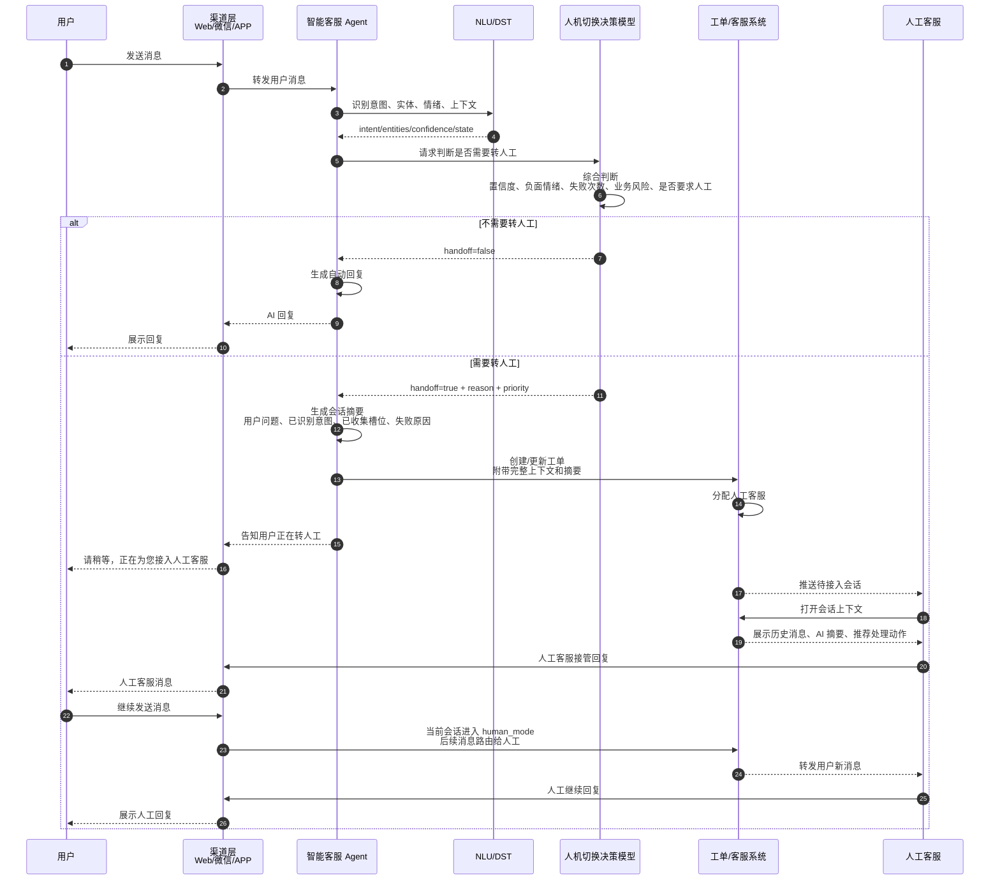
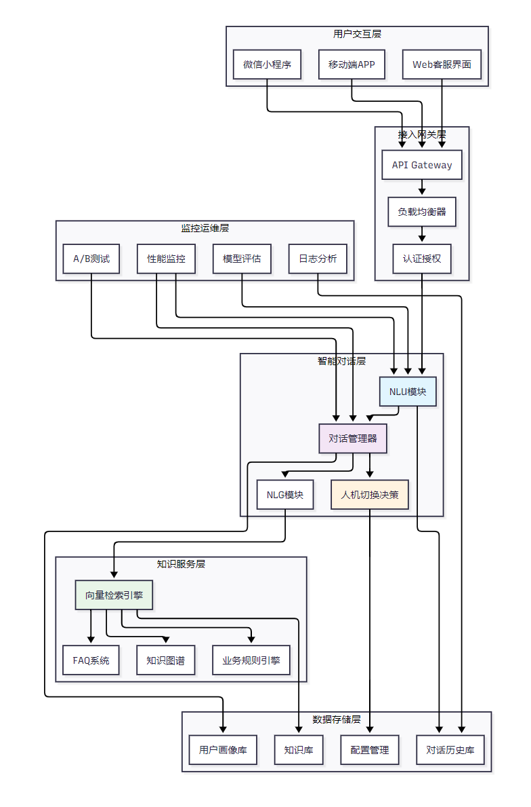
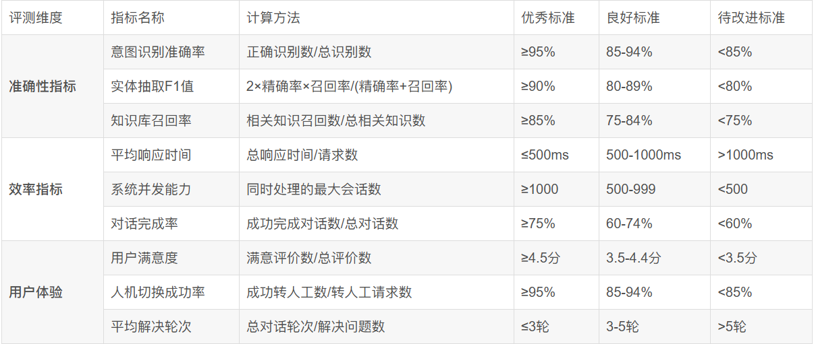
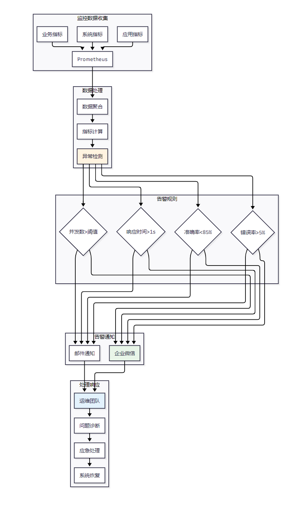

参考文档："D:\AAA_CXD\heima\学习资料\大模型书籍\尚学堂-项目实战\0-1构建智能客服Agent（已脱敏）.pdf"

## 意图识别


| 需求类型 | 具体描述             | 技术挑战               | 解决方案            |
| -------- | -------------------- | ---------------------- | ------------------- |
| 意图识别 | 准确理解用户咨询意图 | 口语化表达、同义词处理 | BERT+BiLSTM+CRF模型 |
| 实体抽取 | 提取关键业务信息     | 领域专有名词、嵌套实体 | 基于标注的NER模型   |
| 多轮对话 | 维护对话上下文状态   | 指代消解、话题切换     | DST+对话策略网络    |
| 知识检索 | 快速匹配相关知识     | 语义相似度计算         | 向量化检索+重排序   |
| 人机切换 | 智能判断转人工时机   | 置信度评估、用户情绪   | 多因子融合决策模型  |


```json
{
  "consultation": {  # 咨询类
    "product_info": ["产品功能", "价格查询", "规格参数"],
    "service_policy": ["退换货", "保修政策", "配送方式"],
    "account_issue": ["账号登录", "密码重置", "信息修改"]
  },
  "complaint": {  # 投诉类
    "product_quality": ["质量问题", "功能异常", "外观缺陷"],
    "service_attitude": ["服务态度", "响应时间", "专业程度"],
    "logistics_issue": ["配送延迟", "包装破损", "地址错误"]
  },
  "transaction": {  # 交易类
    "order_inquiry": ["订单状态", "物流跟踪", "配送信息"],
    "payment_issue": ["支付失败", "退款查询", "发票申请"],
    "after_sales": ["退货申请", "换货流程", "维修预约"]
  }
}
```



## 多轮对话状态跟踪(DST)



以“查订单”为例：



## 动态知识库更新



## ⼈机协作切换机制



## 系统架构





### 性能监控实现



## 总结

经过多个项⽬的实践验证，我深刻认识到构建⼀个真正可⽤的**智能客服Agent系统**绝⾮易事。它不仅需要扎实的技术功底，更需要对业务场景的深度理解和对⽤⼾体验的持续关注。在技术实现⽅⾯，我们发现以下**⼏个关键点**⾄关重要：⾸先是**意图识别的准确性**，这直接影响整个对话的⾛向；其次是**上下⽂状态的有效维护**，这决定了多轮对话的连贯性；再次是**知识库的实时更新能力**，这确保了回复内容的时效性和准确性；最后是**⼈机切换的智能决策**，这是提升⽤⼾满意度的关键环节。

从运维⻆度来看，⽣产环境的稳定性要求我们必须建⽴完善的**监控告警体系**，能够及时发现和处理各种异常情况。同时，**持续的模型优化和知识库维护**也是保证系统性能的重要保障。我们通过A/B测试不断验证新功能的效果，通过⽤⼾反馈持续改进对话策略。

⾯向未来，智能客服Agent技术仍有很⼤的发展空间。多模态交互、情感计算、个性化对话等技术的引⼊将进⼀步提升⽤⼾体验。同时，随着⼤语⾔模型技术的快速发展，如何将其有效融⼊现有的智能客服系统，在保证响应速度的同时提升对话质量，也是我们正在探索的重要⽅向。

我相信，随着技术的不断进步和应⽤场景的深⼊挖掘，智能客服Agent将在更多⾏业和场景中发挥重要作⽤，真正实现"让机器更懂⼈，让服务更智能"的愿景。

