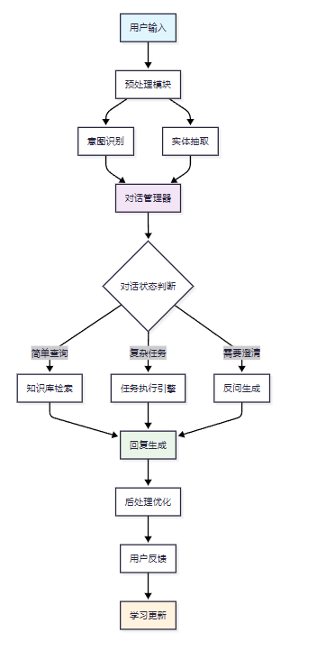

## 数据预处理

语音识别模型：？？？

**扩展**

ASR = STT = 语音识别

TTS = 语音合成

## 意图识别

基于BERT的意图分类器（模型微调）

## 实体抽取

了BiLSTM-CRF架构

## 对话管理器

基于状态机的设计

## RAG知识库

Sentence-BERT（Embedding） + FAISS（检索、向量归⼀化、多重相关性计算、以及索引持久化。）

### 数据获取

数据增强（回译法、大模型生成）

### 数据切分

技术栈：？？？（SentenceSplitter）

## 自动化评估框架

评估指标

- 检索指标

- 生成指标

评估框架

- RAGAS
  - 检索指标
    - 准确率**Context Precision**
    - 召回率**Context Recall**
  - 生成指标
    - 忠实度**Faithfulness**
    - 答案相关性**Response Relevancy**

## 性能优化

## 总结

业务指标 + 性能指标

