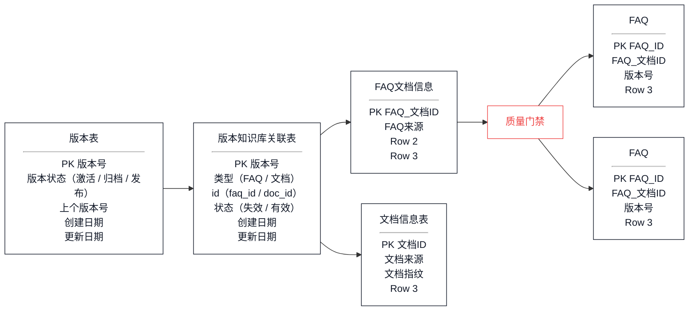
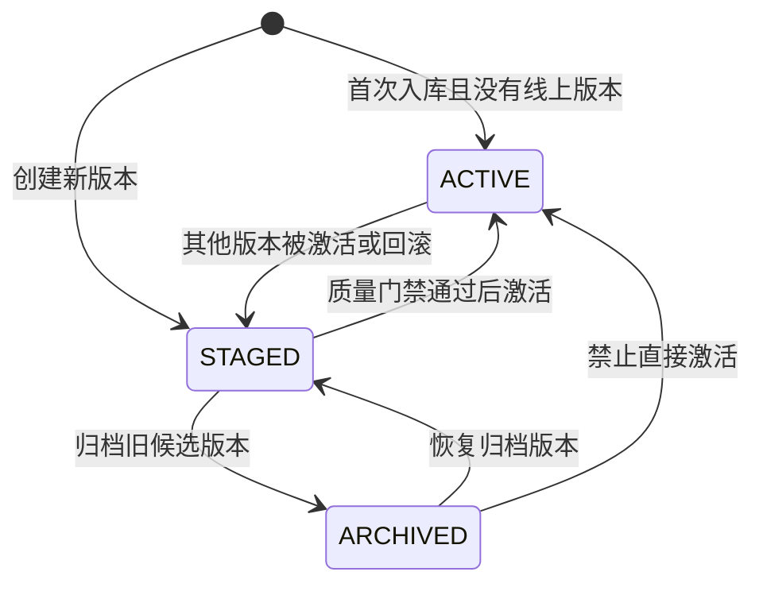

# RAG全局观

## RAG是什么？有什么用？

RAG是`Retrieval-Augmented Generation`，即检索增强生成，它能解决：

- **知识截止日期**：模型训练完成后，无法获取训练数据之后的新信息。例如 GPT-4 的知识截止到 2023 年某月，之后发生的事情它不知道。
- **幻觉问题**：当模型不确定某个答案时，它可能会"编造"一个看起来很合理但实际上是错误的内容。这在企业场景中是不可接受的。
- **私有知识无法覆盖**：企业内部的制度、流程、业务文档是私有数据，从未进入过公开训练集，模型自然无法回答。

## 业务场景


## RAG的三种架构

- RAG Pipeline


## 知识库搭建

#### 文档加载

文档规模：380+

FAQ规模：8100+（历史数据3300，AI抽取文档4800+）

`PDFLoader`：pdf文件

`TextLoader`：txt、md文件

`Docx2txtLoader`：docx文件

`CSVLoader`：csv文件

### 文档标准化

文档标准化其实就是补齐项目级`metadata`，标准化后的Document结构大体构如下：

```python
Document(
    page_content="原始正文基本不改",
    metadata={
        "source": "finance",
        "scenario_id": "...",
        "tenant_id": "default",
        "dataset_id": "default",
        "visibility": "internal",
        "allowed_roles": ["employee"],
        "file_path": "...",
        "file_name": "...",
        "file_type": ".pdf",
        "doc_id": "...",
        "page_index": 0,
        "content_type": "text",
        "kb_version": "...",
        "embedding_model_version": "bge-m3-local-v1",
        "chunk_schema_version": "parent_child_v1",
    }
)
```

表格类的有额外的metadata

```python
metadata={
    "content_type": "table_row",
    "table_id": table_id,
    "sheet_name": str(sheet_name),
    "row_number": row_number,
    "row_count": len(normalized),
    "column_count": len(headers),
    "table_headers": " | ".join(headers),
}
```

FAQ额外的metadata

`page_content` 只放标准问题，答案放在 `metadata.answer`

**参数说明**

| 标准化项      | 写入字段                                                     | 作用                                                        |
| ------------- | ------------------------------------------------------------ | ----------------------------------------------------------- |
| 业务来源      | `source`                                                     | 业务分类：标记 HR、finance、it 等，后续拼 Milvus 过滤表达式 |
| 业务场景      | `scenario_id`                                                | 多场景隔离，避免不同 demo/行业场景混查                      |
| 数据隔离      | `tenant_id`、`dataset_id`、`visibility`、`allowed_roles`     | 支持租户、数据集、可见级别、角色权限过滤                    |
| 文件溯源      | `file_path`、`file_name`、`file_type`                        | 答案引用、质量报告、问题排查时能回到原文件                  |
| 文档稳定标识  | `doc_id`                                                     | 由文件路径、修改时间、大小生成 fingerprint，用于增量入库    |
| 页码/片段位置 | `page_index`                                                 | PDF/loader 有 `page` 时用 page，否则用枚举 index            |
| 内容类型      | `content_type`                                               | 普通文档默认 `text`，表格行保留 `table_row`                 |
| 知识库版本    | `kb_version`                                                 | 线上只检索 active 版本                                      |
| 模型/切分版本 | `embedding_model_version`、`reranker_model_version`、`chunk_schema_version` | 模型或切分策略变更后可重建和对比版本                        |

业务场景scenario_id：

- 企业内部知识助手
- Legal 法务/合同：合同模板、NDA、用印、授权委托书、合同审批、诉讼/仲裁、知识产权、数据处理协议、对外承诺边界
- Procurement 采购：采购申请、供应商准入、比价、招标、PO、收货验收、续约、采购合同、供应商黑名单
- Customer Support 客服/售后：客诉、退款、SLA、故障公告、升级路径、服务话术、知识库、工单分类
- Engineering / R&D 研发：代码规范、发布流程、故障复盘、API文档、环境搭建、架构决策、值班、变更流程
- Training / L&D 培训发展：新员工培训、管理者培训、必修课、认证考试、学习平台、培训预算
- ...

企业知识助手source有：

- HR（人事制度）：入职、离职、请假、考勤、绩效、社保、公积金、转正、试用期、岗位变更
- IT（IT支持）：VPN、电脑、账号、邮箱、权限、网络、打印机、软件、客户数据、外部平台、数据安全、权限回收、系统权限、API Token
- Finance（财务报销）：报销、发票、预算、付款、借款、费用、单据、付款凭证

### 文档切分策略

**父子分块**

- 父块：`chunk_size=1000, overlap=100`
- 子块：`chunk_size=350, overlap = 50`
  - 太大语义稀释，太小语义截断
  - 小块负责找得准，大块负责答得完整
  - 经过评估发现该策略评估指标达到最佳

切分策略

- Markdown：标题结构切分 + 父子分块

- 普通文本/PDF/Word/PPT：父子分块

- CSV/Excel：按行切分，一行一个chunk，归入子块

  ```python
  content = "\n".join(
      [
          f"表格文件：{path.name}",
          f"工作表：{sheet_name}",
          f"表头：{' / '.join(headers)}",
          f"行号：{row_number}",
          "单元格：",
          *cell_lines,
      ]
  )
  documents.append(
      Document(
          page_content=content,
          metadata={
              "content_type": "table_row",
              "table_id": table_id,
              "sheet_name": str(sheet_name),
              "row_number": row_number,
              "row_count": len(normalized),
              "column_count": len(headers),
              "table_headers": " | ".join(headers),
          },
      )
  )
  ```

- FAQ：按结构切，一个标准问答对一个Document，`page_content=标准问题`，答案放在 `metadata.answer`

### 索引

- `HNSW`图索引

### 向量化

使用`BGE-M3`嵌入模型

- 支持中文/英文多语言语义检索
- 长文本适配，最长支持8000+ tokens
- 本地部署可在`GPU/CPU`服务器运行，不需要调用远程`API`节约成本、速度快

> 常见的嵌入模型：
>
> ​	远程用 `text-embedding-v4`
>
> ​	阿里本地模型 `Qwen3-Embedding-0.6B/4B`。
>
> ​	垂直领域：voyage-*

### 数据隔离

**data_scope**：每条数据还有

`tenant_id`：租户

`dataset_id`：数据集

`visibility`：可见级别

`allowed_roles`：允许访问的角色列表

### 文档入库

- 入库时候根据文件指纹进行规则级别的过滤。

### 知识库版本管理

**知识库的版本管理是如何进行版本管理的？**

- 一个知识库 = FAQ库 + 文档库（多文档）
- 知识库级别的激活/归档/回退
- 查询当前激活的版本，获取到版本号，然后使用版本号作为过滤条件
- 建立版本 — FAQ/文档 ID 映射表， （含状态，控制FAQ/知识库是否可用）
- 激活/回退/归档：更新当前版本所有ID的version



- FAQ使用Question相似度阈值 > 95% & Answer相似度阈值 > 95%，认为是同一个问题，质量门禁 + 1
- 知识库使用Chunk混合检索相似度阈值 > 95% ，认为是同一个问题，质量门禁 + 1

- `kb_version`：每个 FAQ 和 chunk 都标记了入库版本号。在线检索时自动拼入 `kb_version == "xxx"` 过滤条件，确保只查 active 版本

##  检索阶段

### 上下文管理

- **聊天历史（`HistoryStore`）**：基于 `LangChain` 的 `SQLChatMessageHistory`，每次问答后写入 `MySQL` 的 `chat_messages` 表，提问时读取最近 6 轮消息 + 历史摘要
- **反馈（`FeedbackStore`）**：用户点赞/点踩后写入 `MySQL`，用于后续 `bad case` 分析和评测集补充

### 意图识别

规则优先 + `LLM` 补充：

### 查询向量化

### 检索策略

检索计划

过滤表达式

###  查询改写与变体

### `Milvus` 混合检索

## 重排阶段

#### 重排序

模型：`BGE Reranker Large`

去重 + 重排（动态计划）：不同意图阈值和TopK是动态配置的。

#### 上下文构建

#### Prompt Profile

## 生成阶段

### 流式生成 + 引用

## 治理与运维

### RAG 回归验收与入库质量

#### 入库质量

质量报告

- 文件解析检查： - 哪些文件解析失败（PDF 损坏、编码错误） - 哪些文件类型不被支持 - 哪些文件为空（没有任何有效文本）
- Chunk 质量检查： - 低质量 chunk：字符数过少（<50 字符）或噪声占比过高 - 重复 chunk：内容高度相似的 chunk 对
- FAQ 质量检查： - question 或 answer 为空的记录 - 完全相同的 FAQ 对（重复录入） - source 不在 valid_sources 白名单中的 FAQ

质量报告指标

| 指标                      | 默认阈值 | 作用                                                |
| ------------------------- | -------- | --------------------------------------------------- |
| `failed_files`            | 0        | 文件解析失败数                                      |
| `unsupported_files`       | 0        | 不支持文件类型，或目录 source 不在场景白名单        |
| `empty_files`             | 0        | loader 没解析出内容的文件                           |
| `ocr_risk_files`          | 0        | 疑似 OCR / 扫描件风险文件                           |
| `low_quality_issues`      | 0        | 低质量 chunk 数，如空 chunk、过短 chunk、噪声 chunk |
| `duplicate_chunks`        | 0        | 重复 chunk 数                                       |
| `empty_faq_questions`     | 0        | FAQ 空问题行                                        |
| `empty_faq_answers`       | 0        | FAQ 空答案行                                        |
| `duplicate_faq_questions` | 0        | FAQ 重复标准问题                                    |
| `invalid_faq_sources`     | 0        | FAQ source 不在当前场景白名单                       |
| `faq_document_conflicts`  | 0        | FAQ 标准答案与正文资料潜在冲突，或缺少正文依据      |
| `faq_file`                | 必须存在 | FAQ CSV 不存在则失败，除非显式允许                  |
| `kb_version`              | 必须存在 | 报告必须能追溯知识库版本                            |
| `embedding_model_version` | 必须存在 | 报告必须记录向量模型版本                            |
| `chunk_schema_version`    | 必须存在 | 报告必须记录切分策略版本                            |

质量门禁

| 条件              | 阈值   |
| :---------------- | :----- |
| 文件解析失败率    | > 5%   |
| 低质量 chunk 比例 | > 10%  |
| FAQ 空值          | > 0 条 |
| FAQ 完全重复      | > 3%   |
| FAQ/正文高度冲突  | > 2 对 |


# 附件

### 如何统一多源文档格式？

- 统一接口设计 ：所有文档解析器都继承自 BaseExtractor 基类，提供统一的 extract() 方法接口
- Word 文档解析 ：在 word_extractor.py 中实现提取文本内容、提取图片并保存到指定目录、处理超链接
- PDF 文档解析 ：在 pdf_extractor.py 中实现按页提取文本内容、保留页面元数据信息
- 统一处理流程 ：通过 extract_processor.py 根据文件扩展名自动选择对应的解析器，所有解析器返回统一格式的 Document 对象
- 扩展性设计 ：通过 unstructured 库作为备选解析方，快速提取内容喂给 LLM

参考dify源码：`https://github.com/langgenius/dify/blob/main/api/core/rag/extractor/word_extractor.py`

### Word文件的解析逻辑

1. 文字一般采用 Python-docx 库直接解析

2. 图片保存到指定的 image_folder 目录中，并被映射到一个 image_map 字典中，键是图片的引用 ID，值是图片的 HTML 格式标签

3. 在处理文档内容时，当遇到图片引用时，会从 image_map 中获取对应的 HTML 标签并插入到内容中，直接处理图片的逻辑相同

4. 最终生成的文档内容会包含文本和图片的 HTML 表示

参考dify源码：https://github.com/langgenius/dify/blob/main/api/core/rag/extractor/word_extractor.py

### 跨页表格怎么自动对齐合并？

**核心挑战**

- 表头重复 ：每一页可能都包含相同的表头。
- 表头重复 ：每一页可能都包含相同的表头。
- 表头重复 ：每一页可能都包含相同的表头。中间存在叶眉页脚
- OCR 识别误差 ：尤其在扫描件中，文字识别错误影响结构恢复。


**解决思路**

- 步骤1：布局预测（Layout Predict）
- 步骤2：文档格式检测（MFD Predict）
- 步骤3：文档格式识别（MFR Predict）
- 步骤4：OCR处理：自动检测到使用CPU时切换为ch_lite语言模型
- 步骤5：表格预测（Table Predict）

> 可和dify配合使用

**解决办法**

MinerU：`https://opendatalab.github.io/MinerU/`

### 领域内术语总混淆，该如何解决？

**问题**：

同一个词在不同场景下有不同含义，导致系统检索错、理解错、回答错。

例如：

- 计算机硬件领域，CPU 表示：中央处理器
- 财务分析里，CPU 表示：每单位成本，Cost Per Unit

*如果没有术语词库，RAG 可能把“成本 CPU”错理解成电脑处理器，答案就跑偏了。*

**核心思想**

**术语词库**提高 RAG 在专业领域里的检索一致性，从而提高召回率和准确率，间接降低幻觉。

**使用方式**

```json
term_glossary = {
    "神经网络": {
        "synonyms": ["人工神经网络", "NN"],
        "definition": "模仿生物神经网络结构和功能的计算模型",
        "context_tags": ["人工智能", "深度学习"],
        "domain": "计算机科学",
        "stop_words": ["神经系统"]
    },
}
```

- 构建知识库

  ```python
  CNN 在图像识别中表现很好。 # 原始文档
  
  标准术语：卷积神经网络  # 术语词库
  别名：CNN、ConvNet、卷基神经网络
  
  卷积神经网络（CNN）在图像识别中表现很好。 # 最终入库文档
  ```

  无论用户问 CNN 还是 卷积神经网络，都更容易匹配到。**括号里不需要写所有别名，只放最常见的别名**。

- 文档切块时：给 chunk 增加 `metadata`

  ```json
  {
    "terms": ["卷积神经网络", "图像识别"],
    "domain": "人工智能",
    "context_tags": ["深度学习", "计算机视觉"]
  }
  ```

  检索时按 domain、terms 过滤或加权，**复杂 query 要做软匹配、多路召回和重排序，硬过滤只能作为高置信度场景下的补充。**

- 用户提问时：先识别和改写查询

  ```python
  CNN 是什么？ # 问题
  
  CNN -> 卷积神经网络  # 术语词表映射
  
  CNN 是什么？ # 查询扩展
  卷积神经网络 是什么？
  ConvNet 是什么？
  ```

  检索时召回率更高

- 检索时：辅助过滤和重排序

  ```python
  CPU 成本怎么计算？ # 用户问题
  
  中央处理器：计算机硬件  # 术语词库
  每单位成本：财务/业务分析
  ```

  优先检索财务领域文档

- 生成答案时：约束模型用标准术语

  ```text
  请优先使用术语词库中的标准术语。
  如果用户使用了别名，先解释别名对应的标准术语。
  不要混用未定义术语。
  ```

### 为什么使用的`BGE-M3`嵌入模型？是否考虑过其它的嵌入模型？

- 支持中文/英文多语言语义检索
- 长文本适配，最长支持8000+ tokens
- 本地部署可在`GPU/CPU`服务器运行，不需要调用远程`API`节约成本、速度快

### 文档为什么要切分？

- LLM的上下文窗口有限，即使现在已经1M，但是不是无限的
- 考虑Token费用
- 注意力衰减

### 索引选型

小规模选暴力检索`FLAT`，中大规模可以选`HSNW`/`IVF_FLAT`,内存不够可以使用压缩版`HSNW-SQ8`/`IVF_SQ8`，主要还是看数据量和预算

### 为什么`RAG`选择`RecursiveCharacterTextSplitter` 而不是 `SemanticChunker`

RAG在构建时往往文档数量较大、追求命中准确，结果稳定。

- `SemanticChunker` 额外调用 Embedding 模型，算力、耗时、成本大幅上升
- `SemanticChunker` 分片长度完全不可控，出现超长Chunk，易引起语义稀释
- `SemanticChunker` 依赖语义，不稳定，带来调参困难

使用场景

- 一版来说结构清晰我们选择递归切分，例如：企业规章制度、操作手册、表格数据、合同条款等等
- 强调语义清晰选择语义切分，例如：会议纪要、访谈、长报告等等

### 业务问题

#### 权限管理是怎么做的？

#### 知识库是如何更新的？

#### 知识库如何回退？



#### 质量门禁是什么？项目中式如何实现的？

用户上传知识库，创建版本，进行质量门禁检查

- 未通过则为`发布失败`
- 通过为`已发布`
- 用户手动点击`激活按钮`来实现版本的切换
- 只有`已发布`的版本可以进行`激活`
- `回退到上一版本`

#### A/B测试

#### 灰度发布

#### 微服务

