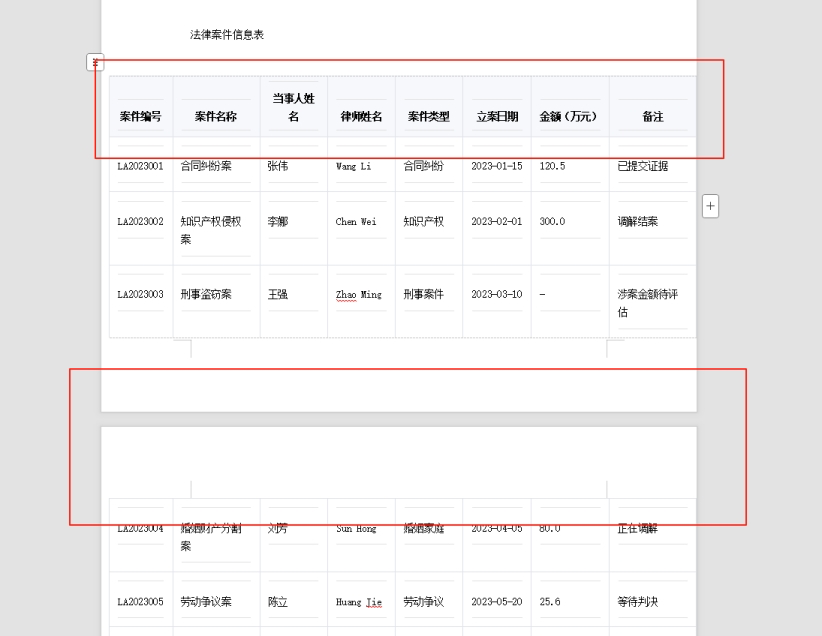
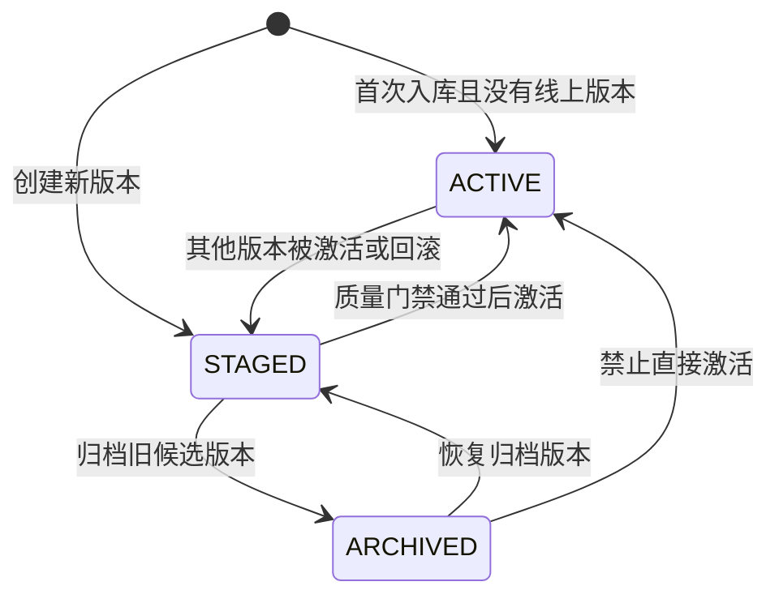

# RAG全局观

## RAG是什么？有什么用？

RAG是`Retrieval-Augmented Generation`，即检索增强生成，它能解决：

- **知识截止日期**：模型训练完成后，无法获取训练数据之后的新信息。例如 GPT-4 的知识截止到 2023 年某月，之后发生的事情它不知道。
- **幻觉问题**：当模型不确定某个答案时，它可能会"编造"一个看起来很合理但实际上是错误的内容。这在企业场景中是不可接受的。
- **私有知识无法覆盖**：企业内部的制度、流程、业务文档是私有数据，从未进入过公开训练集，模型自然无法回答。

## 业务场景


## RAG的三种架构

- RAG Pipeline


## 知识库搭建

#### 文档加载

数据来源（2.4万）：历史数据积累（0.3万）、通过`Ai`从文档抽取标准FAQ（2万）、高频问题总结（0.1万）

#### 文档切分

- 结构化切分
- `chunk_size + overlap`切分

#### 向量化

使用的`BGE-M3`嵌入模型，即支持稠密向量、也支持稀疏向量、可在`GPU/CPU`服务器运行，不需要调用远程`API`节约成本、速度快

#### 知识库版本管理

- `kb_version`：每个 FAQ 和 chunk 都标记了入库版本号。在线检索时自动拼入 `kb_version == "xxx"` 过滤条件，确保只查 active 版本
- **data_scope**：每条数据还有 `tenant_id`、`dataset_id`、`visibility`、`allowed_roles` 字段。检索时拼成 `Milvus` 表达式，实现租户级数据隔离

> 当某个 `STAGED` 版本被激活后，它会变成 `ACTIVE`，原来的 `ACTIVE` 会退回到 `STAGED`，用于保留回滚能力。如果某个旧版本不再作为常规候选，可以从 `STAGED` 变成 `ARCHIVED`,不能将`ARCHIVED`的知识库变为`ACTIVE`,需经过`STAGED`才能转为`ACTIVE`

#### 数据隔离

#### 文档入库

- 离线脚本触发

```text
文档/FAQ → 加载（按后缀选 loader）→ normalize（补 metadata）→ 切分（父子块策略）→ 向量化（BGE-M3）→ 写入 Milvus
```

- 入库时还会做增量判断：通过文件/章节 `fingerprint`（哈希指纹）检查内容是否变化，没变化的跳过，有变化的先删旧 chunk 再写新的。

## 检索阶段

### 上下文管理

- **聊天历史（`HistoryStore`）**：基于 `LangChain` 的 `SQLChatMessageHistory`，每次问答后写入 `MySQL` 的 `chat_messages` 表，提问时读取最近 6 轮消息 + 历史摘要
- **反馈（`FeedbackStore`）**：用户点赞/点踩后写入 `MySQL`，用于后续 `bad case` 分析和评测集补充

### 意图识别

规则优先 + `LLM` 补充：

### 查询向量化

### 检索策略

检索计划

过滤表达式

###  查询改写与变体

### `Milvus` 混合检索

## 重排阶段

#### 重排序

模型：`BGE Reranker Large`

去重 + 重排（动态计划）：不同意图阈值和TopK是动态配置的。

#### 上下文构建

#### Prompt Profile

## 生成阶段

### 流式生成 + 引用


# 附件

### 如何统一多源文档格式？

- 统一接口设计 ：所有文档解析器都继承自 BaseExtractor 基类，提供统一的 extract() 方法接口
- Word 文档解析 ：在 word_extractor.py 中实现提取文本内容、提取图片并保存到指定目录、处理超链接
- PDF 文档解析 ：在 pdf_extractor.py 中实现按页提取文本内容、保留页面元数据信息
- 统一处理流程 ：通过 extract_processor.py 根据文件扩展名自动选择对应的解析器，所有解析器返回统一格式的 Document 对象
- 扩展性设计 ：通过 unstructured 库作为备选解析方，快速提取内容喂给 LLM

参考dify源码：`https://github.com/langgenius/dify/blob/main/api/core/rag/extractor/word_extractor.py`

### Word文件的解析逻辑

1. 文字一般采用 Python-docx 库直接解析

2. 图片保存到指定的 image_folder 目录中，并被映射到一个 image_map 字典中，键是图片的引用 ID，值是图片的 HTML 格式标签

3. 在处理文档内容时，当遇到图片引用时，会从 image_map 中获取对应的 HTML 标签并插入到内容中，直接处理图片的逻辑相同

4. 最终生成的文档内容会包含文本和图片的 HTML 表示

参考dify源码：https://github.com/langgenius/dify/blob/main/api/core/rag/extractor/word_extractor.py

### 跨页表格怎么自动对齐合并？

**核心挑战**

- 表头重复 ：每一页可能都包含相同的表头。
- 表头重复 ：每一页可能都包含相同的表头。
- 表头重复 ：每一页可能都包含相同的表头。中间存在叶眉页脚
- OCR 识别误差 ：尤其在扫描件中，文字识别错误影响结构恢复。



**解决思路**

- 步骤1：布局预测（Layout Predict）
- 步骤2：文档格式检测（MFD Predict）
- 步骤3：文档格式识别（MFR Predict）
- 步骤4：OCR处理：自动检测到使用CPU时切换为ch_lite语言模型
- 步骤5：表格预测（Table Predict）

> 可和dify配合使用

**解决办法**

MinerU：`https://opendatalab.github.io/MinerU/`

### 领域内术语总混淆，该如何解决？

**问题**：

同一个词在不同场景下有不同含义，导致系统检索错、理解错、回答错。

例如：

- 计算机硬件领域，CPU 表示：中央处理器
- 财务分析里，CPU 表示：每单位成本，Cost Per Unit

*如果没有术语词库，RAG 可能把“成本 CPU”错理解成电脑处理器，答案就跑偏了。*

**核心思想**

**术语词库**提高 RAG 在专业领域里的检索一致性，从而提高召回率和准确率，间接降低幻觉。

**使用方式**

```json
term_glossary = {
    "神经网络": {
        "synonyms": ["人工神经网络", "NN"],
        "definition": "模仿生物神经网络结构和功能的计算模型",
        "context_tags": ["人工智能", "深度学习"],
        "domain": "计算机科学",
        "stop_words": ["神经系统"]
    },
}
```

- 构建知识库

  ```python
  CNN 在图像识别中表现很好。 # 原始文档
  
  标准术语：卷积神经网络  # 术语词库
  别名：CNN、ConvNet、卷基神经网络
  
  卷积神经网络（CNN）在图像识别中表现很好。 # 最终入库文档
  ```

  无论用户问 CNN 还是 卷积神经网络，都更容易匹配到。**括号里不需要写所有别名，只放最常见的别名**。

- 文档切块时：给 chunk 增加 `metadata`

  ```json
  {
    "terms": ["卷积神经网络", "图像识别"],
    "domain": "人工智能",
    "context_tags": ["深度学习", "计算机视觉"]
  }
  ```

  检索时按 domain、terms 过滤或加权，**复杂 query 要做软匹配、多路召回和重排序，硬过滤只能作为高置信度场景下的补充。**

- 用户提问时：先识别和改写查询

  ```python
  CNN 是什么？ # 问题
  
  CNN -> 卷积神经网络  # 术语词表映射
  
  CNN 是什么？ # 查询扩展
  卷积神经网络 是什么？
  ConvNet 是什么？
  ```

  检索时召回率更高

- 检索时：辅助过滤和重排序

  ```python
  CPU 成本怎么计算？ # 用户问题
  
  中央处理器：计算机硬件  # 术语词库
  每单位成本：财务/业务分析
  ```

  优先检索财务领域文档

- 生成答案时：约束模型用标准术语

  ```text
  请优先使用术语词库中的标准术语。
  如果用户使用了别名，先解释别名对应的标准术语。
  不要混用未定义术语。
  ```

### 为什么使用的`BGE-M3`嵌入模型？是否考虑过其它的嵌入模型？

- BGE-M3支持稠密、稀疏向量
- 可在本地GPU/CPU上运行速度快，不需要调用外部API、节省成本

### 业务问题

#### 权限管理是怎么做的？

#### 知识库是如何更新的？

#### 知识库如何回退？



#### 质量门禁是什么？项目中式如何实现的？


#### A/B测试

#### 灰度发布

#### 微服务

# 发现的问题

1. 版本管理中`ARCHIVED`设计不合理
   - 项目中：`ARCHIVED` 可以直接到`ACTIVATE`
   - 优化版：`ARCHIVED` 必须通过`STAGED`才能到`ACTIVE`
2. 没有进行查询归一化`NFKC`
3. 质量门禁
   - 项目中：FAQ使用字符直接比较，对于Chunk使用Content计算指纹查重
   - 优化版：质量门禁要查重，对于FAQ使用Question归一化查重，对于Chunk使用Content计算指纹查重

