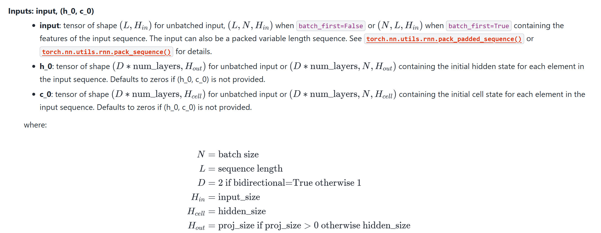
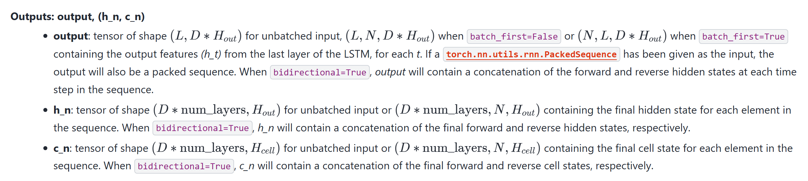

## **自我介绍**

> 姓名+学历+教育背景+工作经历+项目经历+结束语

面试官您好，我叫曹晓东，本科学历，拥有2 年大模型开发经验，和 6 年 Java 开发经验。之前就职于神州数码，主要负责**投满分推荐系统**的开发，该系统提高了用户点击量、订阅量、付费量。我的优势是既有传统软件工程经验，也有大模型应用落地经验，不只是做简单模型调用，而是能够结合业务场景，把知识库、工具链、工作流和大模型能力整合成稳定可用的系统。

**结束语**

最近我一直在研究如何使用 RAG、Agent和模型微调技术来构建**可靠、不越界、可追溯且具有自主成长能力的企业级智能客服助手**，我希望能够把自己的工程化能力和 AI 实践经验结合起来，为团队创造更稳定、可持续的价值。

## **项目介绍**

- NewsCompass 是一个新闻类多文本分类项目，目标是根据新闻标题，自动判断新闻属于哪个频道类别。从而实现新闻的自动分类投递，达到提高用户粘性的目的。
- 指标：以前依赖人工分类，成本高、效率低，现在使用AI技术自动识别类别，不但人工成本降到原来的20%，准确率还提升了20%，达到了现在的92%，实现了降本增效的目的。
- 技术栈：Python、FlaskAPI、机器学习-随机森林、深度学习-FastText技术、基于Transformer架构的Bert模型

## 面试考题

### day01

#### （1）AI研究方向及相关任务

​	AI 方向主要可以分成视觉大模型CV（图片分类、目标检测、图像分割）、自然语言处理NLP（知识抽取、翻译、rag）、底层LLM大模型研究（deepseek）、以及将CV+NLP组合形成的多模态、和未来的全模态。

#### （2）项目背景

​	使用AI技术对新闻自动进行分类，投递到对应的'频道'，从而帮助用户进行新闻主动筛选，从而提高点击量、订阅来来增加用户粘性。

#### （3）项自数据集情况及数据分析详细实现

​	数据集划分为

- 训练集：188212
- 验证集：10235
- 测试集：10345

​	数据分析

- 查看数据，了解数据结构，数据总量
- 数据均衡分析，分析数据类别分布，每一类数据比重，防止某一类数量过少/过多，影响整体系统准确率
- 数据分布分析，通过计算`标准差`，`均值`来计算最优文本长度，让模型训练更快、更准、更省资源

#### （4）A项自构建的流程

1. 构建数据集
2. 构建模型
3. 模型训练
4. 模型预测与评估
5. 模型部署

#### （5）对机器字习的理解及机器学习项目自构建流程

​	机器学习是人工智能的一个分支，主要思想是让机器自己从海量数据种学习规律、完成任务，机器学习构建流程：

1. 获取数据
2. 数据预处理,`train_test_split()`
3. 特征工程，`标准差`
4. 模型训练,`fit(x_train,y_train)`
5. 模型预测,`predict(x_test)`
6. 模型评估
   - 分类
     1. 准确率
     2. 精确率
     3. 召回率
     4. F1-score
   - 回归
     1. MSE
     2. RMSE
     3. MAE
7. 部署与上线

#### （6）便用RF进行文本分类-数据集构建及预处理

​	RF：`Random Forest`

1. 加载数据,`read_csv()`
2. 查看前5行数据，确定数据结构,`data.head()`
3. 查看数据总量,`len(data)`
4. 数据均衡性`Counter(data['label'])`
5. 数据分布分析来确定最佳长度,`data['text_length'] = data['text'].str.len()`,`最佳长度 = μ + 3σ`
6. 特征提取`data['words'] = jieba.lcut()`

#### （7）对TF-IDF的理解?

TF：文章词频，越大越重要

DF：文档词频，越大词越不重要

IDF：逆文档频率，越大词越重要

TF-IDF：词频-逆文档频率，`TF-IDF = TF * IDF`,越大词越重要

### day02

#### （1）使用RF实现文本分类的项目详细流程(代码)

1. 数据分析`EDA`
   - 查看数据集 → 了解数据结构、数据量、训练集/验证集/测试集划分是否合理。
   - 数据均衡性分析 → 了解各分类数据比重，避免`幸存者偏差`。
   - 数据分布分析 → 通过计算`平均值` 、`标准差`计算最优文本长度，从而让模型训练更快、更准、更省资源。
2. 获取数据`pd.read_csv()`
3. 数据预处理`' '.join(jieba.lcut(x)[:30])`
4. 特征工程
   - `TfidfVectorizer(stop_words=config.stopwords_datapath)`
   - `tfidf.fit_transform(x)`
   - ` train_test_split()`
5. 模型训练
   - `model = RandomForestClassifier()`
   - `model.fit()`
6. 模型预测
   - `model.predict()`
7. 模型评估
   - `accuracy_score()`
   - `precision_score()`
   - `recall_score()`
   - `f1_score()`
8. 模型部署
   - `Flask`
     - 导包`from flask import Flask`
     - 实例化`app = Flask(__name__)`
     - 创建路由函数`@app.route('/predict', methods=['POST'])`
     - 启动服务`app.run()`

#### （2）项目模型部署Flask客户端和服务端实现细节

- 服务端
  1. 导包`from flask import Flask`
  2. 实例化`app = Flask(__name__)`
  3. 创建路由函数
     - `@app.route('/predict', methods=['POST'])`
     - 获取请求数据`request.get_json()`
       - 路径参数`/users/1001`
         - 通过形参接受`def get_user(user_id):`
       - 查询参数`/users?id=1001&page=2`
         - `request.args.get("detail", default="false")`
       - 请求体参数`{"name": "Tom"}`
         - `request.get_json()`
     - 调用评估方法`predict(data)`
     - 响应请求`jsonify(result)`
  4. 启动服务`app.run()`
- 客户端
  1. 导包`import requests`
  2. 发送请求`requests.post(url, json=data)`
  3. 接受请求数据`response.json()`

#### （3）对FastText的理解

FastText是 Facebook（Meta）开源的一个轻量级文本分类和词向量训练模型。

**核心特点：**

- 支持词级别和字符级别处理
- 结构简单：词袋 + 线性分类器，不是深度学习
- 速度快

#### （4）Flask构建思路(四步法)及实现细节

1. 导包`from flask import Flask`
2. 实例化`app = Flask(__name__)`
3. 创建路由函数
   - `@app.route('/predict', methods=['POST'])`
   - 获取请求数据`request.get_json()`
     - 路径参数`/users/1001`
       - 通过形参接受`def get_user(user_id):`
     - 查询参数`/users?id=1001&page=2`
       - `request.args.get("detail", default="false")`
     - 请求体参数`{"name": "Tom"}`
       - `request.get_json()`
   - 调用评估方法`predict(data)`
   - 响应请求`jsonify(result)`
4. 启动服务`app.run()`

#### （5）FastText实现文本分类的项目流程及实现细节

FastText 项目流程：

1. 获取数据集。
2. 数据预处理 → 转换成 FastText 格式。
3. 训练模型。
4. 模型预测。
5. 模型评估。
6. 部署接口

#### （6）FastTex数据预处理的思路

- 加载数据
- 使用`class.txt`建立`{编号:类别}`字典映射
- 使用 `line.split("\t")` 拆分文本和标签
- 对文本进行字符级分词
- 最终将数据转化为FastText所需的`__label__classNam Text`格式

### 2225原则

2：构建数据集对象、构建数据加载器

2：构建损失函数，构建优化器

2：2个遍历：遍历训练轮次、遍历数据加载器

5：前向传播、计算损失、梯度清零、反向传播、参数更新

### day03

#### （1）FastText数据预处理

- 加载数据
- 使用`class.txt`建立`{编号:类别}`字典映射
- 使用 `line.split("\t")` 拆分文本和标签
- 对文本进行字符级`list()`/词级分词`jieba.lcut()`
- 最终将数据转化为FastText所需的 `__label__classNam Text`格式

#### （2）Fasttext模型训练的实现细节及性能对比

1. 使用`class.txt`建立`{编号:类别}`字典映射
2. 使用 `line.split("\t")` 拆分训练集文本和标签
3. 对文本进行字符级分词`list()`/ 词级分词`jieba.lcut()`
4. 最终将数据转化为FastText所需的`__label__classNam Text`格式
5. 训练模型`fasttext.train_supervised()`,默认值/自动调参
6. 模型预测`text()`

- 字符级

| 参数     | 准确率 | 耗时 |
| -------- | ------ | ---- |
| 默认值   | 87%    | 4ms  |
| 自动调参 | 91%    | -    |

- 词级

| 参数     | 准确率 | 耗时 |
| -------- | ------ | ---- |
| 默认值   | 90%    | 4ms  |
| 自动调参 | 90%    | -    |

#### （3）BERT模型的介绍

BERT 的本质是一个基于 Transformer Encoder 的双向文本理解器，这里的双向文本理解器有点类似`CBOW`，不过`CBOW`更关注的是词的静态词向量，而`BERT`更关注的是上下文向量

3+2+12+12+768

- 3：指的是3中`Embedding`，包括`Token Embeddding`,`Segment Embedding`,`Positional Embedding` ，也就是`词嵌入`、`句嵌入`、`位置嵌入`
- 2：指的2种训练策略
  - `MLM(Masked Language Model)`：掩码语言模型
  - `NSP(Next Sentence Prediction)`：下一句预测
- 12：12层`Encoder`
- 12：12头注意力
- 768：生成的向量是768维

#### （4）BERT数据集的构建及实现逻辑

- 构建数据集

  - 读取数据，使用`split('\t')`切分文本、标签，得到`[(text,label),]`

- 构建数据加载器

  1. 构建数据加载器`torch.utils.data.DataLoader`，他需要传入一个`torch.utils.data.DataSet`对象

  2. 创建DataSet对象就要求`1个继承3个方法`

     - 继承`torch.utils.data.DataSet`
     - 实现`__init__()`
     - 实现`__len__()`
     - 实现`__getitem__()`，需要它返回`text`和`label`属性

  3. `Bert`要求的数据结构是`input_ids`,`labels`,`attention_mask`,所以就需要`collate_fn`来对batch进行修改，调整为`Bert`需要的格式

     `input_ids`的数据结构为`CLS Text SEP PAD PAD`

  4. 让这个不需要我们手动去写，`Bert`的`tokenizer`已经封装好了，我们只需要调用`batch_encode_plus(texts, padding=True)`将texts传入即可得到所需要的数据

#### （5）对Transformer的理解

- `Transformer`是Google在2017年发表的`《Attention Is All You Need》`中首次提出，

- 常见的Transformer模型有：`Bert`是Encoder-Only Transformer架构（也叫理解型模型），`GPT`是Decoder-Only Transformer架构（也叫生成型模型），T5是Encoder-Decoder Transformer架构。

- `Transformer`主要由4部分组成：输入、Encoder、Decoder、输出。其中最重要的就是`Multi-Head Attention`、`Masked Multi-Head Attention`、`Positional Encoding`

  - `Multi-Head Attention`也就是多种不同角度的`Self-Attention`拼接在一起形成的。

  - `Self-Attention`关注的每个词与其它所有词的关系。

    
    $$
    \mathrm{Attention}(Q, K, V)
    =
    \mathrm{softmax}\left(\frac{QK^\top}{\sqrt{d_k}}\right)V
    $$

  - `Masked Multi-Head Attention`是带掩码的自注意力，每次在预测时将后面的内容盖住，防止偷看答案

  - `Positional Encoding`是加入了位置信息，好让AI知道token之间的前后关系，它使用`sin`、`cos`来实现的位置编码，比如：

    > 我喜欢你，你喜欢我，如果不加Positional Encoding那就是一个意思

  - 

### day04

#### （1）BERT数据预处理的思路及实现细节

- 再数据预处理之前我们首先该确认BERT数据预处理的目标`input_ids`,`attention_masked`,`labels`
- AI项目构建流程
  - 构建数据集
    - 构建数据集的目的是得到`train_dataloader`,`dev_dataloader`,`test_dataloader`这3个`torch.utils.data.DataLoader`对象
    - `DataLoader`有1数据集，3个作用
      - 需要传入`torch.utils.data.dataset.Dataset`对象
        - 继承`Dataset`
        - 实现`__init__()` 
        - 实现`__len__()` 
        - 实现`__getitem__()`方法，返回`text`,`lebal`方便后续使用
      - 打乱数据`shuffle = True`
      - 确定批次数量`batch_size`
      - 确定批次的数据结构`collate_fn`
        - 数据结构其实BERT已经封装好了方法只需要调用分词器的`tokenizer.batch_encode_plus()`即可获得到`input_ids`,`attention_masked`
  - 构建模型
  - 模型训练
  - 模型预测
  - 模型评估
  - 模型部署

#### （2）BERT模型做迁移学习的思路及实现细节

- BERT模型做多分类迁移学习的核心思路是在**预训练 BERT 后面接一个分类头，把 768 维向量映射到类别**

- 构建迁移学习模型，1个继承2个方法

  - 继承`nn.module`

  - 重写`__init__()`

    在BERT预训练模型上增加全连接分类头，使用`nn.Linear()`

    ```python
    self.bert = conf.bert_model
    self.fc = nn.Linear(conf.hidden_size, conf.num_classes)
    ```

  - 重写`forward()`

    预训练模型前向传播到`pooler`后继续传播到新增的分类头

    ```python
    _, pooled = self.bert(input_ids=input_ids, 
                          attention_mask=attention_mask,
                          return_dict=False)
    out = self.fc(pooled)
    return out
    ```

- 接下来就是AI项目构建流程

  - 构建数据集
  - 构建模型
  - 模型训练（225原则）
    - 初始化损失函数、初始化优化器
    - 遍历epoch、遍历dataloader
    - 前向传播、计算损失、梯度清零、反向传播、参数更新
  - 模型预测
    - `model.eval()`：禁用 dropout 和 batch norm
    - `torch.no_grad()`：禁用梯度计算以提高效率并减少内存占用
  - 模型评估
  - 模型部署

#### （3）BERT模型完成训练及预测的思路

AI项目构建流程

- 构建数据集

  - 构建数据集的目的是得到`train_dataloader`,`dev_dataloader`,`test_dataloader`这3个`torch.utils.data.DataLoader`对象
  - `DataLoader`:1个数据集、3个作用
    - 需要传入`torch.utils.data.dataset.Dataset`对象
      - 继承`Dataset`
      - 实现`__init__()` 
      - 实现`__len__()` 
      - 实现`__getitem__()`方法，返回`text`,`lebal`方便后续使用
    - 打乱数据`shuffle = True`
    - 确定批次数量`batch_size`
    - 确定批次的数据结构`collate_fn`
      - 数据结构其实BERT已经封装好了方法只需要调用分词器的`tokenizer.batch_encode_plus()`即可获得到`input_ids`,`attention_masked`

- 构建模型，1个继承2个方法

  - 继承`nn.module`

  - 重写`__init__()`

    在BERT预训练模型上增加全连接分类头，使用`nn.Linear()`

    ```python
    self.bert = conf.bert_model
    self.fc = nn.Linear(conf.hidden_size, conf.num_classes)
    ```

  - 重写`forward()`

    预训练模型前向传播到`pooler`后继续传播到新增的分类头

    ```python
    _, pooled = self.bert(input_ids=input_ids, 
                          attention_mask=attention_mask,
                          return_dict=False)
    out = self.fc(pooled)
    return out
    ```

- 模型训练（225原则）

  - 初始化损失函数、初始化优化器
  - 遍历epoch、遍历dataloader
  - 前向传播、计算损失、梯度清零、反向传播、参数更新

- 模型预测

  - `model.eval()`：禁用 dropout 和 batch norm
  - `torch.no_grad()`：禁用梯度计算以提高效率并减少内存占用

- 模型评估

  - `accuracy`
  - `precision`
  - `recall`
  - `f1-score`

- 模型部署(Flask)

  - 服务端，4步法
    - 导包`from flask import Flask`
    - 实例化`app = Flask(__name__)`
    - 创建路由方法`@app.router(url='/predict', method=['POST'])`
      - 获取参数
        - 请求体`request.get_json()`
        - 路径参数，通过形参获取
        - 请求参数，`request.args.get()`
      - 调用方法
      - 返回响应`return jsonify(response)`
    - 启动服务`app.run(host='127.0.0.1',port='8800')`
  - 客户端
    - 导包`import requests`
    - 发送请求并接受参数`requests.post(url='http://127.0.0.1/predict', json=data).json()`

#### （4）对大模型及国产化算力平台的了解

- 常见AI算力卡

  - NVIDIA A系列：A100、A800，带宽 1.9~2.0 TB/s，80GB，约15万元/张

  - NVIDIA H系列：H100、H200、H800，带宽 3.35 TB/s，80/94GB，约30万元/张

  - NVIDIA B系列：B200，带宽 8 TB/s，192 GB, 约40万元/张（中国禁售）

  - 华为昇腾910A：约32GB，带宽约1.2 TB/s，国产早期高端AI训练卡，约5万~8万元/张
  - 华为昇腾910B：约64GB，带宽约1.0~1.2 TB/s，国产主流大模型训练/推理卡，约8万~12万元/张

- 时间线（国际）
  - 2017年，Google发表《Attention Is All You Need》，Transformer架构成为后续大模型的核心基础。
  - 2018年，OpenAI发布GPT，Google发布BERT，分别代表生成式预训练和双向编码预训练两条重要路线。
  - 2022年11月30日，ChatGPT发布，生成式AI开始大规模进入大众视野。
  - 2024年5月13日，OpenAI发布GPT-4o，推动文本、语音、视觉一体化交互进一步普及。
  - 2023年至2025年，国产大模型快速发展，Qwen、DeepSeek、GLM、ERNIE、Hunyuan、Doubao等模型持续迭代。
  - 2025年1月20日，DeepSeek-R1发布后迅速破圈，显著提升了国产推理模型的社会关注度。
- 时间线（国内）
  - 2023-03-14，ChatGLM 发布，成为国产早期开源中文对话大模型代表之一。
  - 2023-03-16，百度发布文心一言（ERNIE Bot），国内大模型竞赛快速升温。
  - 2023-04，阿里推出通义千问；2023-08 起，Qwen 开源模型族持续发布，开发者影响力快速扩大。
  - 2023年年中到下半年，中国进入“百模大战”阶段。
  - 2023-09-07，腾讯发布混元大模型，腾讯正式全面入局大模型赛道。
  - 2023-10-09，Kimi 上线；2024-03，Kimi 依靠 200 万字长上下文能力快速破圈。
  - 2024-05-15，字节跳动正式发布豆包大模型家族；2024 年下半年，豆包凭借低价和高调用量被广泛关注。
  - 2024-05 起，DeepSeek-V2/V2.5/V3 在行业和开发者圈快速出圈。
  - 2025-01-20，DeepSeek-R1 发布后在大众层面全面破圈。
- 国产大模型LM
  - Qwen
  - Doubao
  - DeepSeek
  - GLM
  - Kimi
  - HunYuan
  - ERNIE
  -  Mimo
- 多模型(MMM)大模型
  - Stable Diffusion：文生图模型
  - FLUX：文生图模型
  - Qwen2.5-VL：视觉语言模型
  - GLM-4V：视觉语言模型
  - 阶跃星辰(视觉大模型)
- 行业黑话
  - M:`million`，百万，小模型参数
  - B:`billion`，十亿，大模型参数，大于该参数称为大模型，13B左右大模型出现`智能涌现`
  - T:`trillion`，万亿，常用来形容训练数据集，比如2.5T，指的是2.5万亿Token量级的训练数据
  - 4卡A100：指4张A100数据中心GPU组成的训练或推理算力配置
  - 8卡H100：指8张H100组成的服务器级算力配置
  - 百亿模型：通常指参数量在10B级别的大模型
  - 千亿模型：通常指参数量在100B级别的大模型

#### （5）DeepSeek实现文本分类的思路及实现细节

关键在于提示词——少样本

#### （6）大模型幻觉问题解决思路的理解

通过 RAG/工具调用 + 约束式提示 + 低随机性解码 + 结果校验 + 持续评测

- 提示词限制，让模型“没有依据就回答不知道，不要猜”
- 外挂知识库，RAG技术
- 地随机参数temperature、top_p
- RAGAS

### day05

#### （1）BiLSTM模型构建流程及形状变换

在构建`BiLSTM`模型之前，我们应该明确它的输入输出是什么？

**输入**

当 `batch_first=True` 时形状为`(N, L, H)`

- N：batch size，批次样本数

- L：sequence length，序列长度
- H：input feature dimension，输入特征维度
- `batch_first` 开关：控制张量第 0 维是「序列长度 L」还是「批次 N」



**输出**：`(input`，`(h_0, c_0))`



**__init__()方法**

1. 了解了`BiLSTM`模型的输入输出后，我们使用1个继承2个方法来构建该模型

   ```python
   self.embedding = nn.Embedding(
       num_embeddings=config.tokenizer.vocab_size,  # 词汇表大小
       embedding_dim=config.embed_size  # 嵌入维度
   )
   ```

2. `embedding`的输出维度等于下一层，也就是`BiLSTM`的输入维度

   ```python
   self.lstm = nn.LSTM(
       input_size=config.embed_size,  # 输入维度
       hidden_size=config.hidden_size_lstm,  # 隐藏状态维度
       num_layers=config.num_layers,  # LSTM层数
       bidirectional=True,  # 双向LSTM，输出维度翻倍
       batch_first=True  # 批次维度优先
   )
   ```

3. Dropout层，防止过拟合

   ```python
   self.dropout = nn.Dropout(p=config.dropout)  # 丢弃概率
   ```

4. 全连接层，分类头，将LSTM的输出维度转为分类

   ```python
   self.fc = nn.Linear(
       in_features=config.hidden_size_lstm * 2,  # 双向LSTM输出维度
       out_features=config.class_num  # 分类类别数
   )
   ```

**forward()**

1. embedding

   输入：`[batch_size, seq_len]` 

   输出：`[batch_size, seq_len, embed_size]`

2. lstm

   输入：`[batch_size, seq_len, embed_size]`

   输出：`[batch_size, seq_len, hidden_size_lstm * 2]`

3. dropout

   输入：`[batch_size, hidden_size_lstm * 2]`

   输出：`[batch_size, hidden_size_lstm * 2]`

4. linear

   输入：`[batch_size, seq_len, hidden_size_lstm * 2]`

   输出：`[batch_size, class_num]`

#### （2）硬标签蒸馏实现流程-代码

1. 构建数据集和数据加载器
2. 初始化教师模型和学生模型
3. 初始化损失函数和优化器`CrossEntropyLoss`、`Adam`
4. 遍历`epoch`和数据加载器
5. 前向传播，
   1. 获取教室模型的硬标签预测值`argmax`
   2. 获取学生模型的`logits`
6. 计算损失
7. 梯度归零
8. 反向传播
9. 参数更新

#### （3）软标签蒸榴实现流程-代码

1. 构建数据集和数据加载器
2. 初始化教师模型和学生模型
3. 初始化损失函数和优化器`CrossEntropyLoss`、`Adam`
4. 遍历`epoch`和数据加载器
5. 前向传播
   1. 获取教师模型的硬标签预测值`argmax`和 软标签概率值
   2. 获取学生模型的`logits` 和 软标签概率值
6. 计算损失
   1. 计算硬损失和软损失
   2. 加权求和
7. 梯度归零
8. 反向传播
9. 参数更新

#### （4）对模型剪枝的理解

模型剪枝是模型压缩的一种常用方式，目的是提升推理速度，发生在模型训练后，核心思想是将神经网络中的稠密连接变为稀疏连接，主要用于cv领域

- 非结构化剪枝：目标是权重，粒度小，保精度。
- 结构化剪枝：目标是神经元/层，粒度大，保推理速度。

#### （5）模型剪枝的实现方式

- 主要借助`torch.nn.utils.prune`的 `global_unstructured()`来实现
- 需要提供
  - 网络层
  - 需要剪枝的参数名称
  - 稀疏度
- 通过`remove()`来确认剪枝操作

## 大模型开发核心技术

### day01

（1）AI、ML、DL之间的关系及AI三要素？
（2）人工智能发展史及代表性事件（详细）？
（3）大模型发展史及代表性事件（详细）？
（4）对机器字习算法的理解（包含各算法原理）
（5）对集成字习算法的专业理解（思想+原理）
（6）数据集类型及特征工程？

### day02

（1）机器学习算法项自构建流程及具体实现
（2）特征工程的详细理解？
（3）模型拟合情况有哪些？
（4）KNN算法的基本原理（包含距离）及具体实现？
（5）便用KNN实现鸢尾花的详细流程？
（6）介绍深度学习框架？介绍深度学习推理框架

### day03

（1）介绍一下Pytorch?
（2）CUDA环境安装流程？
（3）Pytorch-GPU版本安装流程？
（4）张量类型有哪些？
（5）线性张量创建方式及主要区别
（6）全为指定值张量的创建方式

### day04

（1）张量元素类型转换方式？
（2）张量类型转换的方式？
（3）点乘和点积的区别？
（4）张量的运算函数？
（5）张量索引操作？
（6）张量形状操作reshape与view的区别？

### day05

（1）张量的升维降维操作及Pytorch实现方式？
（2）Transpose和Permute的区别和联系？
（3）深度字习反回传播算法是什么，如何实现？
（4）神经网络定义及构成？
（5）常见的激活函数及特性？
（6）常用的初始化方法原理及Pvtorch实现？

### day06

（1）神经网络搭建方法？
（2）分类损失函数原理及实现方法？
（3）回归损失函数原理及实现方法？
（4）梯度下降算法是什么？
（5）反回传播的定义及基本原理？
（6）梯度下降优化万法-momentum？

### day07

（1）详细讲解梯度下降优化万法?
（2）学习率衰减策略及实现?
（3）缓解过拟合的方法？
（4）深度学习项自构建流程？
（5）现有cSV文件，如何构建数据集？
（6）魔搭社区是什么？能做什么？体验过哪些应用？

### day08

（1）计算机视觉的定义及网络构成
（2）计算机视觉发展史
（3）卷积层及池化层是什么？特征图计算公式？
（4）案例-CIFAR数据集读取?
（5）案例-模型构建（详细步骤）？
（6）案例-模型训练预测步骤？
（7）YOLOv5项自实操步骤?

### day09

（1）NLP的定义及基本流程？
（2）文本向量化的步骤及实现代码？-分词-去重等
（3）对RNN及LSTM、GRU的理解?
（4）RNN网络输入输出形状?
（5）案例-构建词表的流程？
（6）案例-数据集构建流程？
（7）案例-模型构建流程？
（8）对Transformer输入部分的理解?
