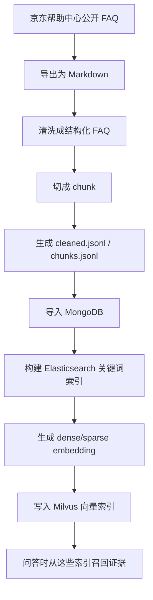
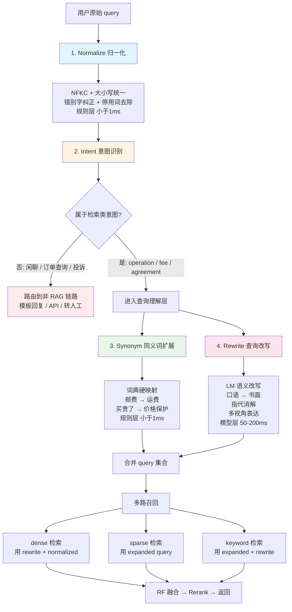
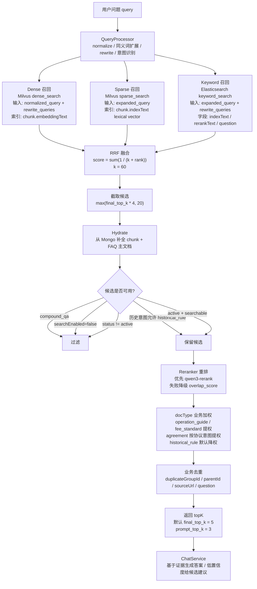

# FAQ智能助手项目复盘

## 自问自答

## 该智能客服系统特点

> 客服 FAQ 检索，query 短、领域收敛、对延迟敏感

### 知识库构建



#### 文档清洗都做了什么？

- 文档清洗，删除空白、空行（节省 token 和存储成本、避免产生空 chunk 或低质量 chunk、归一文本形态）

- 提取文档发布日期（防止使用答案进行回答）

- 删除图片（图片未入库，删除无效内容）

- 删除客服兜底话术（防止向量坍塌、防止污染关键词检索、节省token）

- 

- 补充文档类型（doc_type）(检索过滤、重排序加权，比如historical_rule 不参与回答)

  - fee_standard       运费、收费、服务费等
  - operation_guide    如何、怎么、流程、步骤
  - service_intro      服务说明、什么是、介绍
  - policy_rule        规则、细则、标准
  - agreement          协议、隐私政策
  - historical_rule    已失效、历史规则
  - faq                普通问答
  - compound_qa        复合问答父文档

  

- 增加状态（状态）：

  - `status=active/expired`（历史规则或有失效日期的文档会标成 expired）

  - `search_enabled=true/false`（复合问答父文档 compound_qa 不是最终可回答粒度，也会关闭搜索）

    ```python
    status = "expired" if doc_type == "historical_rule" or expired_date else "active"
    search_enabled = doc_type != "compound_qa" and status != "expired"
    ```

- 生成 embedding_text 和 index_text

  - ```text
    embeddingText = category_path + question + answer
    ```

  - ```text
    index_text = category_path + question + answer + source_url + canonical_terms + synonym_terms
    ```

- 打质量标签（给 RAG 系统增加可观测性和风险控制，让系统知道：这条知识有没有缺陷、适合不适合直接召回、后续是否需要专项处理。）

  - short_answer
  - missing_image_context
  - table_candidate
  - compound_qa_source
  - historical_content
  - long_policy_text
  - numbered_qa_source

  

- 按答案长度分 chunk

  - ```text
    answer_clean <= 1200 字符：
      一条 FAQ 一个 chunk
    
    1200 < answer_clean <= 3000 字符：
      按段落合并，单 chunk 目标上限 1200 字符
    
    answer_clean > 3000 字符：
      按段落合并，单 chunk 上限放宽到 1600 字符
    ```

  - 为什么没有用滑动窗口？

  - ```text
    项目已经把“问题 + 分类 + 答案片段”一起构造成 embedding_text，不是只拿裸片段做向量。也就是说，每个 chunk 都带问题和分类上下文，边界处不太依赖 overlap 补上下文。如果再用滑动窗口，比如 1200 字符窗口、200 字符 overlap，会制造很多重复 chunk，反而增加召回重复和业务去重压力。
    ```

#### 表结构

- `canbe_faq_rag_faq_items`:**FAQ 主文档**

  - 这是“可展示的完整问答”，相当于知识库事实表。

  - ```json
    {
      "id": "jd_help_57_127",
      "question": "我的订单，为什么会被拆分？",
      "similarQuestions": [],
      "answer": "订单拆分有以下几种情况...",
      "answerRaw": "...",
      "embeddingText": "分类路径 + 问题 + 答案",
      "indexText": "分类 + 问题 + 答案 + source_url",
      "category": "订单百事通",
      "categoryName": "订单百事通 > 订单拆分 > 拆分订单",
      "categoryL1": "订单百事通",
      "categoryL2": "订单拆分",
      "categoryL3": "拆分订单",
      "categoryPath": "订单百事通 > 订单拆分 > 拆分订单",
      "docType": "faq",
      "status": "active",
      "searchEnabled": true,
      "source": "京东帮助中心公开 FAQ",
      "sourceUrl": "https://help.jd.com/user/issue/57-127.html",
      "enabled": true,
      "priority": 1,
      "qualityFlags": ["short_answer"],
      "pageDate": "2018-11-14",
      "duplicateGroupId": null,
      "createdAt": "...",
      "updatedAt": "..."
    }
    ```

  - 

- `canbe_faq_rag_faq_chunks`:**检索片段表**

  - 给召回、重排用的 chunk 表。向量库和 ES 命中后，会拿 chunkId/faqId 回 Mongo 补全文本和来源。

  - ```json
    {
      "id": "jd_help_57_127_chunk_001",
      "faqId": "jd_help_57_127",
      "parentId": "jd_help_57_127",
      "chunkIndex": 1,
      "chunkText": "订单拆分有以下几种情况...",
      "chunkTitle": "我的订单，为什么会被拆分？",
      "question": "我的订单，为什么会被拆分？",
      "embeddingText": "给 dense embedding 用",
      "indexText": "给 keyword/sparse 检索用",
      "rerankText": "给 rerank 模型判断相关性用",
      "sourceUrl": "https://help.jd.com/user/issue/57-127.html",
      "categoryL1": "...",
      "categoryL2": "...",
      "categoryL3": "...",
      "docType": "faq",
      "status": "active",
      "searchEnabled": true,
      "enabled": true,
      "qualityFlags": [],
      "createdAt": "...",
      "updatedAt": "..."
    }
    ```

- `canbe_faq_rag_chat_logs`

  - **问答日志**：保存每次问答链路的结果，便于排查和回放。

  - ```json
    {
      "traceId": "...",
      "sessionId": "...",
      "query": "忘记密码怎么办？",
      "answer": "...",
      "fallback": false,
      "confidence": 0.82,
      "sourceIds": ["jd_help_xxx"],
      "debug": {},
      "createdAt": "..."
    }
    ```

    

- `canbe_faq_rag_feedback_logs`**用户反馈**

  - ```json
    {
      "traceId": "...",
      "feedbackType": "useful | useless | unresolved",
      "sessionId": "...",
      "comment": "...",
      "createdAt": "..."
    }
    ```

  - 

- `canbe_faq_rag_eval_sets`**评测相关集合**

  - 评测集元信息

  - ```json
    // eval_sets
    {
      "eval_set_id": "eval_xxx",
      "name": "jd_help_eval_v1",
      "status": "ready",
      "source_path": "exports/jd_help_faq.cleaned.jsonl",
      "source_hash": "...",
      "config": {},
      "summary": {},
      "created_at": "..."
    }
    ```

  - 

- `canbe_faq_rag_eval_cases`

  - 单条评测 case

  - ```json
    // eval_cases
    {
      "eval_set_id": "eval_xxx",
      "case_id": "case_xxx",
      "question": "...",
      "eval_type": "single_chunk | multi_chunk",
      "expected_chunk_ids": ["jd_help_xxx_chunk_001"],
      "category": "...",
      "difficulty": "...",
      "question_style": "..."
    }
    ```

  - 

- `canbe_faq_rag_eval_runs`

  - 一次评测运行

  - ```json
    {
      "_id": "run_a7bc7fb94aec42419f131fa4d620dd7f",
      "case_count": 60,
      "created_at": "2026-05-18T07:41:39.249Z",
      "eval_set_id": "eval_a68defcf5c664abb9b8553be7a9f6436",
      "progress": {
        "completed_cases": 60,
        "total_cases": 60,
        "percent": 1,
        "updated_at": "2026-05-18T07:42:18.341Z"
      },
      "rag_config": {
        "configured_k": 5,
        "retrieval_top_n": 20,
        "similarity_threshold": 0.72,
        "rerank_enabled": true,
        "case_concurrency_override": "",
        "commit_batch_size_override": "",
        "case_concurrency": 5,
        "commit_batch_size": 10
      },
      "run_id": "run_a7bc7fb94aec42419f131fa4d620dd7f",
      "started_at": "2026-05-18T07:41:39.249Z",
      "status": "completed",
      "summary": {
        "total": 60,
        "hit_at_k": 0.8166666666666667,
        "recall_at_k": 0.75,
        "ndcg_at_k": 0.7059296855104276,
        "precision_at_configured_k": 0.17,
        "filtered_precision": 0.4775,
        "filtered_recall": 0.6916666666666667,
        "filtered_avg_k": 2.1166666666666667,
        "filtered_empty_context_rate": 0.06666666666666667,
        "success_rate": 1,
        "error_count": 0
      },
      "completed_at": "2026-05-18T07:42:18.341Z",
      "timing": {
        "total_ms": 39089.15,
        "retrieve_ms": 184780.34,
        "commit_ms": 14860.88,
        "summary_ms": 0.1,
        "cases": 60
      }
    }
    ```

  - 

- `canbe_faq_rag_eval_run_results`

  - 每条 case 的运行结果和指标

  - ```json
    // eval_run_results
    {
      "run_id": "run_xxx",
      "case_id": "case_xxx",
      "question": "...",
      "expected_chunk_ids": [],
      "top_k_chunk_ids": [],
      "retrieved_chunk_ids": [],
      "metrics": {
        "hit_at_k": true,
        "recall_at_k": 1.0,
        "filtered_recall": 1.0
      },
      "diagnostics": {}
    }
    ```

- `canbe_faq_rag_search_index`：**Elasticsearch Index**

  - ```json
    {
      "chunkId": "keyword",
      "faqId": "keyword",
      "question": "text",
      "rerankText": "text",
      "indexText": "text",
      "embeddingText": "text",
      "categoryL1": "keyword",
      "categoryL2": "keyword",
      "categoryL3": "keyword",
      "categoryPath": "keyword",
      "docType": "keyword",
      "status": "keyword",
      "searchEnabled": "boolean",
      "parentId": "keyword",
      "duplicateGroupId": "keyword",
      "sourceUrl": "keyword",
      "enabled": "boolean"
    }
    ```

- canbe_faq_rag_vector_index：**Milvus Collection**

  - ```json
    {
      "id": "VARCHAR primary key",
      "chunk_id": "VARCHAR",
      "faq_id": "VARCHAR",
      "dense_vector": "FLOAT_VECTOR, dim=1024",
      "sparse_vector": "SPARSE_FLOAT_VECTOR"
    }
    ```

- 索引

  - dense_vector: HNSW + COSINE
  - sparse_vector: SPARSE_INVERTED_INDEX + IP

- **Redis**

  - canbe_faq_rag:status:import
  - canbe_faq_rag:status:build_index
  - canbe_faq_rag:import:task:{task_id}
  - canbe_faq_rag:index:task:{task_id}

### 检索策略



- 查询归一化`normalize`: 本项目使用的是`NFKC`

  - 为什么要进行查询归一化？

    > 统一查询文本，减少因全角、半角、大小写、标点不同导致的召回差异

  - 企业当中是如何实现的？

    >生产系统不会只做一层，通常是逐级递进：
    >
    >| 层级 | 处理内容 | 目的 | |------|------| | L0 字符级 | NFKC +大小写 + 全半角 | 你现在做的这层 | | L1 词汇级 | 停用词去除、错别字纠正、繁简转换 | 减少噪音 | | L2 语义级 | 同义词归并、缩写展开、口语→书面 | 拉近 query 和文档的距离 | | L3 业务级 | 实体识别、敏感词过滤、query 分类路由 | 业务逻辑 |

  - 本项目的最佳实现推荐

    > 1. 保留 NFKC 作为基础层
    >
    > 2. 错别字纠正（规则 + 词典）：
    >
    >    数据来源：线上 query 日志中的高频 typo 聚类。
    >
    >    ```python
    >    TYPO_MAP = {
    >        "京东白条": ["金东白条", "京东百条", "jd白条"],
    >        "价格保护": ["价格保户", "价保"],
    >        "售后": ["收后", "兽后"],
    >    }
    >    ```
    >
    > 3. 停用词 + 语气词去除
    >
    >    ```python
    >    STOPWORDS = {"啊", "呢", "吧", "嘛", "哦", "的", "了吗", "呀", "哈",
    >                 "帮我", "请问", "你好", "麻烦"}
    >    ```
    >
    >    客服 query 里语气词和礼貌用语占比很高，去掉后 embedding 质量明显提升
    >
    > 4. 业务实体归一化
    >
    >    ```python
    >    # "iPhone16 Pro Max" / "苹果16pro" / "i16pm" → 统一实体标签
    >    # "白条" / "京东白条" / "JD白条" → "京东白条"
    >    ```
    >
    >    对于客服场景，核心实体就那几类：商品名、服务名（白条/PLUS/物流）、操作动词。用正则 + 词典就能覆盖 90%。

  - 为什么不使用模型归一化？

    >1. **延迟** — 归一化在检索最前面，每次请求必经，加模型就多 50-200ms，而规则 <1ms
    >2. **确定性** — 同一个 query 每次归一化结果必须一致（缓存依赖这个），模型输出有随机性
    >3. **可调试** — 线上出了 bad case，规则能秒定位，模型是黑盒

- 标准词、同义词扩展`synonyms`：项目中基于规则文件实现

  - 为什么要做标准词和同义词扩展？

    >- keyword/sparse 检索是按"词面"匹配的，主要为提高keyword/sparse召回率（Recall），宁可多召回一些后面让 rerank 去筛，也不要在召回阶段就漏掉。
    >- 由于用户表达和知识库文档之间存在语义鸿沟

  - 企业当中是如何实现的? 

    >- 离线扩展（聚类）：从 query 日志和点击日志中自动发现同义关系
    >- 动态扩展：dense 检索

  - 当前项目最佳实现推荐

    > 1. 词级字典机制（jieba）
    >
    > 2. 利用dense 检索的隐式同义能力，增大`retrieval_dense_top_k`
    >
    > 3. 离线同义词挖掘
    >
    >    线上日志 → 文本聚类（阈值过滤） → 同义词候选 → 人工审核 → 入库

- 重写`rewirte`：项目中基于规则的，

  - 为什么要进行重写?

    >- 由于用户表达和知识库文档之间存在语义鸿沟
    >
    >- 把用户的话翻译成知识库能听懂的话
    >
    >- 比如：
    >
    >  - **表达多样性** — 用户说"邮费"，知识库写的是"运费"
    >
    >  - **query 过短/过口语化** — "企微咋付款"这种 query，embedding 质量差，关键词也匹配不上正式文档。
    >
    >  - **多轮指代** — "它怎么退"，不把"它"还原成具体商品，检索就是盲搜。
    >
    >  - **意图聚焦** — 用户一句话可能包含多个信息需求，拆开分别检索效果更好。

  - 企业当中是如何实现的？

    >- 主流做法是用 LLM 做 query expansion/rewrite，prompt 类似："将用户问题改写为 3 种不同表达，保持语义一致"
    >- 多轮对话中做指代消解，使用LLM 
    >- 让 LLM 生成一段假设性答案，用答案的 embedding 去检索
    >- 同义词表/规则改写作为补充层，处理确定性高的映射（如缩写展开）

  - 本项目最佳实现推荐？

    >- 第一层：规则（保留现有逻辑，0 延迟）
    >
    >  - 标准化、同义词展开、已知模式改写
    >
    >  - 这层不动，它是确定性兜底
    >
    >- 第二层：LM 轻量改写（加在规则之后、检索之前）
    >
    >  - 通用 LLM few-shot 就够用
    >  - LM 改写可以用便宜的小模型（qwen-turbo / glm-4-flash），单次 <100ms，成本极低

  - 为什么使用 LLM 而不是 fine-tune 小模型？

    > 初期：fine-tune 需要大量 query pair 训练数据，维护成本高，日均访问量 <  10 万次
    >
    > 后期：用户量/访问量上来，再考虑fine-tune 小模型
    >
    > 计算方式：自部署3B模型成本83元/天（主备2台就是167元/天），167 / 0.002 = 8.4万/天
    >
    > 模型选择：中文友好 + 有客服领域语料 + 一定的语义理解能力 + 不需要大模型通用推理能力

- 意图识别`intent`：项目中基于规则的

  - 为什么要做意图识别？

    >意图识别的本质是给 RAG 系统装一个"路由器"——决定哪些 query 该进 RAG、进了之后偏向哪些文档、生成时用什么风格回答。

  - 企业当中是如何实现的？ 

    > - 零样本启动使用LLM（延迟高、token成本）
    > - 有标注数据后使用Bert文本分类模型 （速度快、需要标注数据、新增意图需重新训练）
    >
    > 
    >
    > - 小场景使用文本分类模型（BERT/轻量 LM fine-tune），训练数据就是历史 query + 人工标注的意图标签
    > - 大型场景用 LLM few-shot 分类
    > - 多轮对话场景会结合上下文做 slot filling（槽位填充）
    > - 规则兜底仍然保留，用于处理模型不确定或延迟过高时的降级




- 检索：多路召回

  - 稠密检索`dense_search`

    - 嵌入字段：`chunk.embeddingText`

      ```python
      embeddingText = category + question + answer
      ```

    - 输入字段：``normalized_query`和`rewrite_queries`

    - 表名：`milvus`的`canbe_faq_rag_vector_index`

    - 字段名：`milvus`的`dense_vector`

  - 稀疏检索`sparse_search`：

    - 嵌入字段：`chunk.indexText`

      ```python
      indexText = category_path + question + answer + source_url + canonical_terms + synonym_terms
      ```

    - 查询值：`expanded_query`

    - 查询字段：`milvus`的`sparse_vector`

  - 关键字检索`keyword_search`

    - 查询值：`expanded_query`和`rewrite_queries`
    - 查询字段：`Elasticsearch`的`indexText`/`rerankText`/`question`

### 重排策略

- 使用RRF融合（保留rrf_top_k）
- 获取候选名单 20 个（保留final_top_k * 重排候选乘数）
- Rerank重排：**在通用模型不懂业务的盲区上做修正**：reranker 知道"什么相关"，权重表知道"什么有用"
- 同一业务问题只保留最强候选

### 生成阶段

- 置信度

  - 置信度有什么作用？

    > 决定是否走兜底分支


  - 本项目的最佳实践推荐（也是企业当中的做法）

    > - 分阶段演进，先做"加权融合版"
    >
    >   - top1 rerank 分数（基础信号） `s-rerank`
    >   - top1 top2 区分度 `s_gap = top1_socre - top2_score`
    >   - 多路一致性：3路召回都出现了给予高置信度 `s_consensus`
    >   - 加权融合 `confidence_socre = 0.6*s_rerank + 0.2*s_gap + 0.2*s_consensus`
    >
    > - 分级阈值
    >
    >   ```python
    >   confidence:
    >     high_threshold: 0.75      # 高于此值：直接给答案
    >     medium_threshold: 0.5     # 中间：给答案 + 建议
    >     low_threshold: 0.3        # 低于此值：兜底，只给建议
    >   
    >   # 代码逻辑：
    >   if confidence >= settings.high_threshold:
    >       # 自信回答
    >   elif confidence >= settings.medium_threshold:
    >       # 给答案 + "如果不是你想问的，看这些"
    >   elif confidence >= settings.low_threshold:
    >       # 不给答案，只给建议问题
    >   else:
    >       # 完全兜底，建议转人工
    >   ```
    >
    > - 积累数据后：进化为学习式
    >
    >   ```text
    >   训练数据：(query, candidates, 用户反馈是否点赞/有用) → 二分类
    >   模型：LightGBM 或 LR，特征就是上面那些信号
    >   产出：替换掉硬编码权重，用模型预测真实置信度
    >   ```
    >
    >   


- 引用来源


### 手册更新怎么做？

### 缓存怎么做？

### 经验库怎么做？

### 评估后台会有未命中消息列表提示，提供根据Ai一键生成/人工填写答案？


## 1. 这个 Agent 架构设计是为了解决什么问题? 是特定领域,还是通用?

**解决什么问题?**

```text
如何将公开帮助文档怎么变成一个可靠、不越界、可追溯的 FAQ 问答系统
```

**是特定领域,还是通用?**

- 它的“题材”是特定领域
- 它的“做题方法”是通用工程方法

  ```text
  查询归一化、同义词扩展、混合检索、RRF 融合、重排、来源约束、越界防护、fallback，这一整套方法并不只适用于京东 FAQ，也可以迁移到企业知识库、SOP、政策库、售后文档、内部帮助中心。
  ```

## 企业知识库、FAQ、客服问答如何提升检索召回率？

企业知识库、FAQ、帮助中心这类场景里，用户语言和文档语言通常不是一个分布。如果不做增强，系统经常不是“没有答案”，而是“答案存在，但用户的话和文档的话对不上”。

这个问题在实际场景里很常见，主要有三类矛盾。

- 第一类是用户说口语、简称、别名，文档写正式术语。
- 第二类是用户的问题很短、信息不完整，但文档写得很长、很规范。
- 第三类是同一句话在不同业务分类下可能含义不同，如果只做一次粗检索，很容易歧义召回。

所以一个成熟的检索系统，通常不会只存一份原始文本，也不会只跑一次原始 query，而是会同时做三件事。

1. **文档侧增强。**
目标是让文档更容易被命中。比如把文档按更合适的粒度切分，补充结构化字段、别名、类型信息，或者做更利于检索的索引组织。这样用户即使不是按文档原话提问，系统也更容易把候选捞上来。

2. **查询侧增强。**
目标是让用户的话更容易对齐文档语言。常见做法就是 normalize、同义词扩展、query rewrite，把“口语表达”和“正式表达”之间的距离缩短。这个动作的本质，不是替用户重写问题，而是尽量把用户真实意图保留下来，同时让检索系统更容易理解。

3. **多路召回与重排。**
因为相关性不是单一维度，不能假设一种检索方式永远最强。关键词匹配擅长术语和短 query，语义检索擅长口语化和改写问题，最后还需要 rerank 去判断哪些候选真正最适合当前问题。所以这些路径更像互补关系，而不是替代关系。

**利弊抉择**

你做了文档增强、查询增强、多路召回和重排，系统一定会更复杂，索引更多，参数更多，链路也更长。如果做得不好，还可能把 query 改坏，或者引入新的误召回。但在知识库问答场景里，这个复杂度通常是值得的，因为它换来的是更稳定的 recall 和更高的 top-k 命中率，尤其是在非标准问法、短 query 和歧义 query 上。

**如何验证**

- 非标准问法命中率有没有提升
- 短 query 和术语型 query 的 top-k 命中有没有改善
- rewrite 和增强后是否引入了新的误召回
- Recall@K、MRR、最终 answerable hit rate 有没有实质提升

所以如果要用一句适合面试的总述来概括，我会说：

> 这套方案的核心目标，是缩短用户语言和文档语言之间的表达鸿沟，在尽量不牺牲精度的前提下，提高召回率、Top-K 命中率和最终答案的稳定性。

## 2. `embeddingText` 是怎么设计的？为什么？

`embeddingText` 主要是给语义检索路径用的，也就是给向量模型做 embedding 的输入文本。
我的设计不是只用 question，而是更偏向把它组织成：

```text
embeddingText = category + question + answer
```

这么做的核心原因是：FAQ 场景里的标题通常太短、太模板化、太容易歧义，只拿标题做向量表示，语义信息往往不够。

**先说为什么不能只用 question。**

FAQ 标题在真实数据里经常是这种形式：

```text
如何申请
怎么查看
可以提现吗
如何处理
为什么失败
```

这类标题的问题是语义太稀薄。它缺业务对象、缺上下文、缺条件，最后生成出来的向量就容易“泛相关”，导致召回不稳定。尤其在你的这个项目里，FAQ 很多问题都属于规则类和流程类，如果标题本身过短，向量空间里不同 FAQ 就容易挤在一起。所以把 category 拼进去。

**为什么使用 category**

category 的作用，不是简单加一个标签，而是给短问题补一个稳定的业务语境。比如：

```text
category = 售后/价格保护
question = 可以补差价吗
```

和

```text
category = 财务/退款
question = 可以提现吗
```

如果只看问题本身，它们都很短，甚至不同 FAQ 之间会共享很多类似句式。但一旦加上分类，向量模型就更容易知道：这个问题是在什么业务坐标系下成立的。所以可以把它理解成：

- question 提供的是用户表层意图
- category 提供的是稳定业务上下文

但只加 category + question 还不够，所以我还会把 answer 拼进去。

**为什么使用 answer**

因为答案里通常有三类标题里没有的信息：

- 更正式的业务术语
- 更完整的条件限制
- 更充分的上下文展开

比如用户问“价保能不能补”，标题可能也只写成一个很短的问题，但答案里会出现“价格保护”“订单支付后 X 天内”“同款商品”“差价返还条件”这些更标准、更细化的表达。
这些内容对向量模型非常重要，因为它能让 FAQ 的语义表示更稳定，也更容易和用户 query 在语义空间里对齐。

如果换一种方式总结，三者分工大概是：

- question：表层问题
- category：业务语境
- answer：完整语义展开

把它们拼在一起之后，FAQ 对 embedding 模型来说，不再只是一个短标题，而更像一个语义完整体。这会比只拿标题做向量表示更稳，尤其是在非标准问法、短 query、歧义 query 上。

**利弊抉择**

把 answer 拼进去之后，文本更长了，噪声也可能更多。如果答案里有很多和当前核心问题关系不大的补充说明，向量表示有时候会被拉得太“宽”，导致主题变泛。所以这个设计并不是天然最优，它更像一个在 FAQ 场景下的工程折中：我接受一点文本冗余，换更完整的语义表达。而且它也不意味着只靠 embedding 就够了，所以我在这个项目里仍然保留了 BM25、RRF 和 rerank，因为向量检索只是混合检索链路里的其中一路。

**如何验证**

这个设计值不值得，不是靠直觉判断，而是要看评测,我会重点比较几种方案：

- 只用 question
- question + answer
- category + question + answer

然后看它们在这些 query 上的表现：

- 非标准问法
- 很短的规则类 query
- 容易歧义的业务 query
- 口语化和错别字 query

如果 category + question + answer 在 Recall@K、MRR、最终 answerable hit rate 上更稳，尤其是在短 query 和歧义 query 上提升明显，那这个设计就是值得的。

所以如果让我用一句适合面试的话来概括，我会说：

> embeddingText 主要服务语义检索。只用 FAQ 标题做 embedding 往往不够，因为标题通常很短、模板化、歧义高。把 category + question + answer 拼起来，本质上是在给短标题补业务语境和标准语义展开，让单条 FAQ 从一个“短问题”变成一个“语义完整体”，从而提高向量召回的稳定性。

---

## 3. `index_text` 是什么，为什么要比 `embeddingText` 更“啰嗦”

### 3.1 定义

```text
index_text = category_path + question + answer + source_url + canonical_terms + synonym_terms
```

它通常服务于关键词检索、倒排索引、BM25、sparse retrieval，或者混合检索里的 lexical 路径。

### 3.2 它和 `embeddingText` 的根本区别

一个非常容易被问到的问题是：

**为什么已经有 `embeddingText` 了，还需要 `index_text`？**

答案是：两者优化目标不同。

- `embeddingText` 追求语义表达完整，服务向量检索
- `index_text` 追求关键词覆盖全面，服务词法检索

前者更像“语义画像”，后者更像“关键词资产包”。

### 3.3 为什么 `index_text` 要尽量全

因为倒排检索本质上依赖“词项命中”。  
如果用户用的是简称、口语、别名，而文档里没有这些词，BM25 再强也匹配不上。

所以 `index_text` 常常会显式补进：

- `canonical_terms`：规范词、正式名
- `synonym_terms`：同义词、别名、简称、口语表达
- `category_path`：完整分类路径，补业务上下文
- `source_url`：有时用于来源定位、站点级区分或调试追踪

### 3.4 典型适用场景

最适合解决这类问题：

- 简称导致召回缺失
- 口语导致召回缺失
- 别名导致召回缺失
- 文档术语和用户术语不一致

例如：

```text
企微 -> 企业微信
价保 -> 价格保护
开票 -> 发票
```

### 3.5 适合面试的表达

> `index_text` 主要服务 lexical/sparse 检索，所以设计原则不是“文本优雅”，而是“可命中的关键词尽量全”。它会显式加入规范词、同义词、别名、分类路径等信息，目的就是降低 vocabulary mismatch，提升关键词召回率。

---

## 4. `embeddingText` 与 `index_text` 的关系

可以把它们理解成两条并行但互补的文档表达：

| 字段 | 主要服务对象 | 优先目标 | 典型内容 |
|---|---|---|---|
| `embeddingText` | 向量检索 | 语义完整性 | `category + question + answer` |
| `index_text` | 关键词/倒排检索 | 词项覆盖率 | `category_path + question + answer + canonical_terms + synonym_terms + source_url` |

如果用类比来讲：

- `embeddingText` 像“给模型读的语义版文档”
- `index_text` 像“给搜索引擎建倒排的关键词版文档”

两者不是二选一，而是典型的混合检索配套设计。

---

## 5. 查询侧三层结构：`normalized_query`、`expanded_query`、`rewrite_queries`

这是面试里非常值得讲清楚的一组概念，因为它们看起来都像“改 query”，但职责完全不同。

### 5.1 `normalized_query`：保真统一

**定义：**

对用户的输入进行清洗

```text
normalized_query = 对原始用户输入做清洗后的结果
```

- 全角半角统一
- 大小写统一
- 空白、标点、特殊符号清洗
- 简繁、大小写、数字格式规范化
- 词表归一化中的轻量替换

**作用：**

使用户的输入标准化，为后面的`expanded_query` ， `rewrite_queries`, `向量检索` , `同义词扩展`奠定基础，从而提高召回率。

**核心原则：**

- 尽量保留原意
- 不主动引入新语义

如何实现的：`NFKC`

**适合面试的短句：**

> `normalized_query`就是用户原始问题经过标准化处理后的检索输入。它通常会做字符统一、标点清洗、空白清洗、轻量口语规整等处理，目的是减少输入层的噪声，让同一个意思的不同写法尽量映射到更稳定的 query 表达上。在 FAQ RAG 场景里，这一步很重要，因为用户提问往往很口语、很短、格式也不稳定，如果不先做 normalize，后面的检索质量会明显波动。

### 5.2 `expanded_query`：扩词查询

定义：

```text
expanded_query = 在原 query 基础上补充同义词、规范词、相关词后的查询表达
```

例如：

```text
原始 query: 价保可以提现吗
expanded_query: 价保 价格保护 补差价 买贵了 提现 退款 返回金额
```
**作用：**

它主要增强的是 lexical / sparse 路径，因为这些路径高度依赖词项覆盖。

**核心特点：**

- 通常保留原 query
- 在旁边补词，而不是完全改写句子
- 目标是提高召回覆盖率

**怎么验证：**

- BM25 / sparse 路径的 Recall@K
- 术语型短 query 的命中率
- 歧义 query 上的 topK 质量
- 最终 answerable hit rate 是否更稳

适合面试的短句：

> `expanded_query` 解决的是“说法不全”的问题。它不是重写一句更自然的话，而是在原 query 周围补足可命中的词。

### 5.3 `rewrite_queries`：改写表达，跨越语言鸿沟

定义：

```text
rewrite_queries = 将用户表达改写成更接近文档表达或检索友好的多个候选 query
```

例如：

```text
原始 query: 企微能不能走网银
rewrite_1: 企业微信是否支持网银支付
rewrite_2: 企业微信支持哪些支付方式
rewrite_3: 企业微信端是否可使用网银付款
```

它主要解决：

- 用户说法太口语
- 用户表达不完整
- 用户语言和文档术语不一致
- 原 query 不适合直接检索

适合面试的短句：

> `rewrite_queries` 解决的是“表达方式不对齐”的问题。它不是简单补词，而是把用户语言翻译成更接近文档语言、系统语言或业务语言的表达。

### 5.4 三者对比表

| 组件 | 核心职责 | 是否改变原意 | 典型用途 |
|---|---|---|---|
| `normalized_query` | 统一输入格式 | 基本不改变 | 输入清洗、标准化 |
| `expanded_query` | 扩词提升覆盖 | 轻微扩展，但不偏离主题 | lexical / sparse 召回 |
| `rewrite_queries` | 改写表达方式 | 可能换一种说法表达同一意图 | 跨越用户语言与文档语言鸿沟 |

---

## 6. 企业级 `rewrite_query` 为什么通常是一个系统，而不是一个模型

成熟系统里的 query rewrite，通常不是“丢给 LLM 改一句话”这么简单，而是：

> **规则 + 词表 + 实体抽取 + 多候选改写 + 评测闭环**

原因很现实：

- 纯规则不够泛化
- 纯词表不够灵活
- 纯 LLM 不够稳定、不可控、成本高
- 没有评测闭环，就无法判断改写到底是帮忙还是添乱

下面分开看。

---

## 7. 规则：处理稳定高频特例

规则最适合处理那些：

- 高频
- 稳定
- 业务上确定无歧义
- 一旦命中就值得强干预

例如：

```yml
- name: wecom_netbank
  when:
    all_terms: ["企微", "网银"]
  rewrites:
    - "企业微信是否支持网银支付"
```

解释成自然语言就是：

```text
如果 query 同时命中“企微”和“网银”
就追加一个改写：
企业微信是否支持网银支付
```

规则的优点：

- 可控
- 可解释
- 对高频坑位见效快

规则的缺点：

- 覆盖有限
- 维护成本会随业务增长
- 长尾问题处理能力弱

适合面试的表达：

> 规则适合兜住高频确定性问题，它不是主力泛化手段，但在企业级场景里往往是 ROI 很高的一层。

---

## 8. 词表：让“用户词”和“系统词”对齐

### 8.1 词表的本质

词表不是简单的“同义词表”，更准确地说，它是业务概念层的映射表。

例如：

```yml
价格保护:
  canonical: 价格保护
  aliases:
    - 价保
    - 补差价
    - 买贵了
```

这里的关键不在于“字面相似”，而在于它们都指向同一个业务概念。

### 8.2 典型处理流程

实现方式通常很直接：

1. 先把 query 做归一化。
2. 扫描词表。
3. 命中任一 alias 或 canonical。
4. 提取该概念的 canonical 和 aliases。
5. 用于扩查询、扩文档、触发规则。

### 8.3 词表为什么特别重要

因为很多检索问题根本不是“模型不聪明”，而是“词不对”。

比如：

```text
用户说“价保”
文档写“价格保护”
```

如果没有词表：

- lexical 检索可能直接漏召回
- query rewrite 也不一定每次都稳定改到位

所以词表其实是企业知识检索里的“低技术含量、高业务价值”资产。

适合面试的表达：

> 词表层解决的是概念对齐问题。用户说的是 alias，文档写的是 canonical，系统需要把这两种表述收敛到同一个业务概念上。

---

## 9. 实体抽取：不要只改一句话，还要抽结构

### 9.1 什么叫实体抽取

实体抽取不是把整句话改写得更通顺，而是先把 query 里的关键业务对象拆出来。

例如用户问：

```text
华东区企业微信客户能不能用网银支付
```

系统可能抽出：

```json
{
  "region": "华东区",
  "product": "企业微信",
  "customer_type": "企业客户",
  "payment_method": "网银"
}
```

### 9.2 常见实现方式

- 规则 / 正则
- 词典匹配
- NER 模型 / LLM 抽取

### 9.3 抽出来以后能做什么

通常有两件事：

1. 改写 query
2. 生成 filter

例如：

```text
rewrite: 企业微信是否支持网银支付
filter: region=华东区 AND customer_type=企业客户
```

这一点非常重要。  
很多人把 query rewrite 只理解成“改写文本”，但在企业检索里，更高价值的一步往往是把文本意图拆成：

- 可检索文本
- 可执行过滤条件

适合面试的表达：

> 实体抽取把自由文本 query 变成“文本意图 + 结构化约束”。前者用于召回，后者用于 filter，这比只改写一句话更接近生产系统。

---

## 10. 多候选改写：不要赌一条 rewrite

例如用户输入：

```text
企微能不能走网银
```

系统可能生成：

- `normalized_query`：企微能不能走网银
- `expanded_query`：企微能不能走网银 企业微信 网银 支付
- `rewrite_1`：企业微信是否支持网银支付
- `rewrite_2`：企业微信支持哪些支付方式

为什么不只留一个？

因为真实世界里的意图经常不是唯一映射：

- 用户可能问的是“是否支持网银”
- 也可能真正需要的是“有哪些支付方式”
- 还可能需要走“企业微信端”这一特定产品语境

所以更稳妥的做法通常是：

1. 多路生成候选 query
2. 多路召回
3. 用融合算法粗排
4. 再用 reranker 精排

典型表达：

```text
多路召回 -> RRF 粗排 -> Reranker 精排
```

适合面试的表达：

> 单条 rewrite 风险在于押错表达，多候选 rewrite 的思路更像“并行假设检验”，先扩大正确答案进入候选集的概率，再交给 reranker 统一排序。

---

## 11. 为什么常见架构是 RRF + Reranker

### 11.1 RRF 解决什么问题

当系统同时跑多路召回时，比如：

- 原始 query
- expanded query
- rewrite query
- 向量召回
- 关键词召回

每一路都会给出一个排序列表。  
RRF（Reciprocal Rank Fusion）用于把多个列表融合成一个统一候选集。

常见形式是：

\[
\mathrm{RRF}(d)=\sum_{i=1}^{n}\frac{1}{k + rank_i(d)}
\]

其中：

- \(d\) 是文档
- \(rank_i(d)\) 是文档在第 \(i\) 路结果中的名次
- \(k\) 是平滑常数

直觉上看：

- 在多条路径里都排得靠前的文档，会得到更高分
- 它不要求不同召回通道的原始分数可直接比较

这很适合混合检索场景。

### 11.2 Reranker 解决什么问题

RRF 的目标是“把候选合起来”，但它对深层语义判断仍然有限。  
Reranker 的目标是：对候选集做更高质量的相关性判断。

可以简单理解成：

- RRF 负责“别漏”
- Reranker 负责“排准”

适合面试的表达：

> 多路召回阶段更关心 recall，融合阶段常用 RRF，因为它对不同检索通道的分数尺度不敏感；最后再用 reranker 提升 precision 和最终排序质量。

---

## 12. 评测闭环：为什么这是企业级系统的分水岭

很多 query rewrite 方案在 demo 里都很好看，但一上生产就可能出现两个问题：

- 改写后误召回变多
- 对少数 query 有帮助，但整体收益不稳定

所以企业级系统一定要有评测闭环。

### 12.1 怎么做

准备一批真实 query，并给每个 query 标注：

- 正确文档
- 正确答案
- 可接受候选集

然后分别测试：

- 不改写
- 只用规则
- 只用词表
- 只用实体抽取
- 只用 LLM rewrite
- 多策略组合

### 12.2 看哪些指标

常见指标包括：

- Recall@K
- Hit@K
- MRR
- NDCG
- 误召回率
- 改写触发率
- 改写后收益覆盖率

### 12.3 最重要的原则

不是“能改写就改写”，而是：

> 只保留那些在离线评测和线上效果里都真正有效的改写策略。

适合面试的表达：

> Query rewrite 是一个高收益但高风险模块，因为它直接修改了检索入口。没有评测闭环，就无法知道它是在提高 recall，还是在系统性引入噪声。

---

## 13. 一个适合直接背诵的面试回答

如果面试官问：

**“你们为什么要设计 `embeddingText`、`index_text`、normalized/expanded/rewrite query 这些层？”**

可以这样回答：

> 在企业知识检索里，用户语言和文档语言经常不一致，所以我们会同时做文档侧增强和查询侧增强。  
> 文档侧我一般分两套表达：一套是 `embeddingText = category + question + answer`，主要服务向量检索，用来给短标题补稳定语义上下文；另一套是 `index_text = category_path + question + answer + canonical_terms + synonym_terms + source_url`，主要服务倒排/BM25，用来尽量补全关键词覆盖。  
> 查询侧我会分三层：`normalized_query` 负责保真统一输入，`expanded_query` 负责扩词提升 lexical recall，`rewrite_queries` 负责把用户语言改写成更接近文档语言的表达。  
> 在生产上，rewrite 不是单点模型能力，而是规则、词表、实体抽取、多候选改写和评测闭环组合起来的系统。最终一般通过多路召回、RRF 融合和 reranker 精排，兼顾 recall 和 precision。

---

## 14. 面试时很容易被追问的几个点

### 14.1 为什么 `embeddingText` 不直接包含 synonym_terms

通常不建议把太多人工扩展词无脑塞进 embedding 文本里，因为：

- 向量模型更重视自然语义分布
- 过多噪声词可能污染语义表达
- 同义词扩展更适合 lexical 路径

所以常见思路是：

- `embeddingText` 保持相对自然、语义完整
- `index_text` 则更强调可命中词覆盖

### 14.2 rewrite 会不会带来误召回

会，而且这是 rewrite 最大风险之一。  
所以要：

- 控制触发条件
- 保留原 query 并行召回
- 使用多候选而不是单候选赌博
- 做离线评测和线上监控

### 14.3 query rewrite 和 query expansion 的本质区别

一句话概括：

- expansion 是“补词”
- rewrite 是“换一种说法表达同一个意图”

前者更偏词项覆盖，后者更偏语义映射。

### 14.4 实体抽取为什么重要

因为企业检索里很多约束本来就不应该靠自由文本匹配，而应该变成结构化过滤。

例如：

- 地区
- 客户类型
- 商品类型
- 渠道
- 时间范围

把这些条件从 query 里抽出来，比把整句话无限改写更稳。

---

## 15. 可直接记忆的金句

### 15.1 关于 `embeddingText`

> `embeddingText` 的本质，是给短问题补上业务上下文和标准语义展开，让向量表示更稳定。

### 15.2 关于 `index_text`

> `index_text` 的本质，不是写给人看，而是写给倒排索引命中，所以关键词覆盖越完整越好。

### 15.3 关于三层 query

> `normalized_query` 负责保真，`expanded_query` 负责扩词，`rewrite_queries` 负责跨越用户语言和文档语言的表达鸿沟。

### 15.4 关于企业级 rewrite

> 企业级 query rewrite 不是一个 prompt，而是一个由规则、词表、实体抽取、多候选生成和评测闭环组成的系统。

### 15.5 关于系统目标

> 检索系统优化的重点，不是把 query 改得更漂亮，而是让正确答案更稳定地进入 Top-K。

---

## 16. 数学直觉补充：为什么向量检索和词法检索要并存

向量检索常用相似度，如余弦相似度：

\[
\cos(\theta)=\frac{\mathbf{q}\cdot \mathbf{d}}{\|\mathbf{q}\|\|\mathbf{d}\|}
\]

其中：

- \(\mathbf{q}\) 是 query 向量
- \(\mathbf{d}\) 是文档向量

它擅长解决的是“意思相近但词不一样”的问题。  
但它对以下内容未必天然占优：

- 精确术语
- 编号
- SKU
- 专有名词
- 极短高约束 query

而 BM25 这类词法检索更擅长精确词项匹配。  
所以企业系统通常会采用 hybrid retrieval，而不是押注单一路径。

---

## 17. 参考资料

以下资料用于核对本文中的关键表述：

- [Azure AI Search: Hybrid search overview](https://learn.microsoft.com/en-us/azure/search/hybrid-search-overview)
- [Azure AI Search: Hybrid search scoring with RRF](https://learn.microsoft.com/en-us/azure/search/hybrid-search-ranking)
- [Azure AI Search: Rewrite queries with semantic ranker](https://learn.microsoft.com/en-us/azure/search/semantic-how-to-query-rewrite)
- [Azure AI Search: Search filters](https://learn.microsoft.com/en-us/azure/search/search-filters)
- [Vectara Docs: Intelligent query rewriting](https://docs.vectara.com/docs/tutorials/intelligent-query-rewriting)
- [Vectara Docs: Filters](https://docs.vectara.com/docs/search-and-retrieval/filters)

### 核对结论

- `hybrid retrieval + RRF + reranker` 是业界常见且有公开文档支持的组合。
- query rewrite 在公开产品文档里，确实不仅涉及文本改写，也常与 metadata filter / structured constraints 配合。
- `expanded_query` 与 `rewrite_queries` 的职责区分，虽然不是某一厂商的官方固定命名，但这是一种非常合理、工程上常见的分层方式。
